Title: Aldea Luna et l'attente dans le nord argentin
Date: 2019-03-26 20:40
Category: Amerique du sud
Slug: AldeaLuna
Status: published
SubTitle: Ou l'attente pour un chargeur de portable
Cover: images/AldeaLuna/AldeaLuna_01.jpg
Thumbnail: images/AldeaLuna/AldeaLuna_02.jpg

# Le volontariat à Aldea Luna
## Le lieu
Nous avons profité d'un petit temps en Argentine pour faire un volontariat de 2 semaines un peu à l'écart de la civilisation, pour nous ressourcer et rencontrer des gens. Et aussi pour prendre des cours d'espagnol (surtout utile pour moi).

Nous nous sommes donc rendu à la réserve naturelle d'Aldea Luna. Alors déjà Aldea Luna c'est un lieu complètement isolé, géographiquement et technologiquement. Un seul chemin (pas une route, un chemin) qui cette année a été très abîmé par les fortes pluies et qu'il est inenvisageable de prendre sans un 4x4. Déjà qu'avec ça passe pas toujours… Et puis une fois arrivé, pas d'électricité (seulement des batteries solaire), pas de signal de téléphone, nada. Ça peut faire peur un peu au début, mais très vite on s'y fait.  
C'est un lieu au milieu d'une réserve naturelle donc, qui entend protéger la nature au maximum et qui essaie d'avoir un impact le plus faible sur son environnement et être le plus autonome possible. La difficulté d'accès à la civilisation l'y oblige un peu, et malgré un jardin conséquent, on ne parle pas encore d'autosuffisance. Mais on peut tout de même y vivre un vrai rapprochement avec la nature et une vie plus simple.  
Il y a une cabane pour les volontaires en contrebas, deux cabanes pour les touristes ou semi-volontaires comme nous (on y reviendra) et une bâtisse principale pour tout le reste (cuisiner, manger, lire, jouer, bref un lieu de vie).

Tout autour, des chemins de randonnées pour parcourir la réserve remplie d'animaux, et notamment d'un nombre impressionnant d'oiseaux.

## Une journée type
Notre semi-volontariat consistait en 3 heures de travail du lundi au vendredi et une petite compensation financière, contre une logement et 3 repas végétariens par jour. Ce à quoi on a rajouté 2h de cours d'espagnol par jour pour Maïlys et moi. En effet la gérante Elizabeth a été de nombreuses années professeure d'école. Donc elle possède à la fois l'expérience, la pédagogie et quelques supports de cours bien utiles. Et croyez-moi ça m'a été bien plus qu'utile, j'ai énormément progressé en 2 semaines (et je partais de pratiquement rien). Et Maïlys a pu revoir ses bases ce qui semble-t-il lui a fait du bien.

Alors du coup, à quoi ressemblaient nos journées ?
Le matin levé entre 7h30 et 8h, petit déjeuner avec les pains préparés de la veille, et boulot de 9h à 12h. Cela pouvait être du jardinage, de la réparation de sentier (c'est-à-dire bouger des pierres et creuser, globalement), construire des escaliers ou encore arpenter les sentiers de randonnées en nettoyant à la machette.  
Ensuite on aidait à la cuisine puis on se sustentait. Là on avait un planning tournant pour déterminer qui s'atteler à la vaisselle, à la préparation de la pâte à pain. Ensuite vers 17h il fallait faire cuire nos petits pains, bien entendu, pour le petit déjeuner du lendemain.  
Le reste de l'après-midi était un temps libre, souvent occupé par une sieste, un peu de lecture et nos exercices pour le cours d'espagnol qui était de 17h à 19h. Donc finalement assez peu de glandouille je trouve.  
Ensuite on aidait à préparer le repas, essentiellement en coupant les légumes, et puis on mangeait avec tous les volontaires et touristes. Ensuite on jouait au carte, quelque fois il y a eu un feu de camp, on discutait, jouait à la guitare, bref ça dépendait de l'humeur et du temps.

Voilà une journée type en quelque sorte.

## L'instant espagnol
Por causa de las clases de espagnol, yo prometi a Belen que iba a escribir un poco en esta idioma. Y por que lo debo a Elizabeth tambien. Entonces, vamos !

Que puedo decir mas ? Como yo vivi este voluntario ?
Despues de tres semanas con nuestros amigos, en uno grupo de seis franceses, no estuve facil de empiezar hablar espagnol con los otros voluntarios. Pero fueron muy lindos conmigo y probaron hablar despacio con palabras simplas. Muchas gracias.  
Pero fueron las classes que me hizieron progresar. Elizabeth tiene mucha paciencia y es muy pedagogica. Sus clases son simplas y adaptadas por nosotros los viajeros. Muy practica. Muchas muchas gracias Elizabeth.

Despues tres semanas con nuestros amigos visitando muchos lugares, necesitamos tiempo mas despacio y calmo. Aldea luna es el lugar perfecto para esto. Con mucha naturaleza y poco de distraccion. Un lugar bueno tambien para hacer Qi Gong y ejercisios para mi espuelda. Y un lugar donde comemos mucho mejor que los restaurantes con carne, postres y alcohol. Entonces un lugar muy bueno para la salud.

Muchas gracias tambien Daniel y Bruno los brasileros, Nina, Martin y Belen para todo los buenos momentos con ustedes. (On a bien rigolé).

# Santiago del Estero et San Miguel de Tucuman
Un petit mot rapide sur ces deux villes du nord argentin. On s'est retrouvés, comme vous le savez déjà, avec un petit soucis de chargeur de pc portable. Donc on a dû attendre que celui-ci soit livré à notre réparateur pour pouvoir passer à la suite, la Bolivie. On a donc pris notre mal en patience et décidé de visiter un peu le coin sans trop s'éloigner. On passera quelques teps à Salvador de Jujuy histoire de tout régler, puis on décide de bouger.

Notre choix s'est donc porté sur Santiago del Estero dans un premier temps. Une ville calme, tranquille, peu touristique, où on aura commencé par glandouiller un peu pour le 1er mai. On s'imagine pouvoir aller aux termes de Rio Honda, la ville voisine, mais on s'est rendu compte que contrairement à ce qu'on peut avoir en France, ici tous les termes sont privés dans des hôtels. Chacun a sa petite source d'eau thermale, mais il n'y a pas franchement de lieu pour juste une petite baignade, il faut être clients des établissements. Tant pis.

On décide ensuite d'aller à San Miguel de Tucuman. La ville, encore une fois, a peu d'intérêt touristique en elle-même, ce sont surtout les environs qui amènent quelques voyageurs à prendre la ville comme base de départ. Et pour le peu qu'on a vu, en effet les environs sont plutôt très jolis.

Il reste que ces moments dans des villes argentines moins touristiques nous ont aussi permis de voir un peu mieux ce que ressemblait une vie argentine classique, dans des lieux qui ne vivent pas du tourisme. Certes on aurait préféré passer plus vite en Bolivie, mais il faut bien retirer quelque chose de ce petit désagrément.

    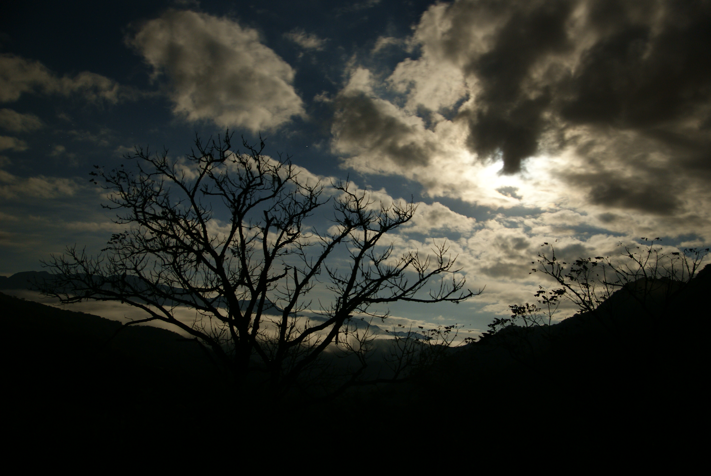
    
    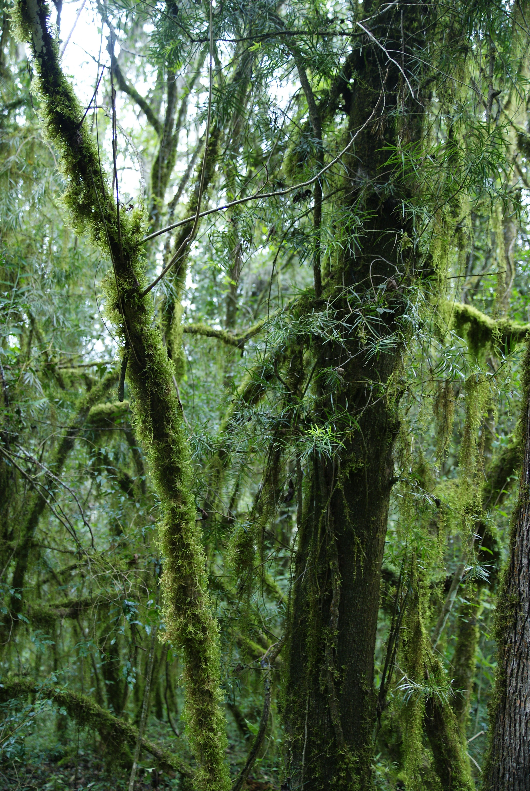
    
    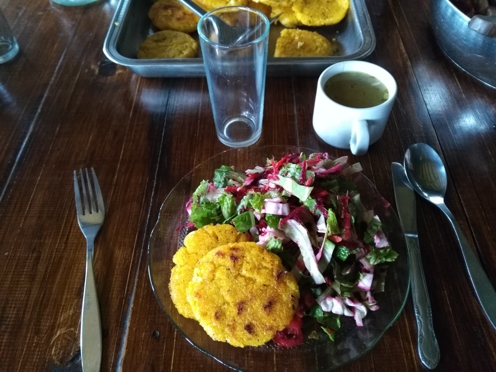
    
    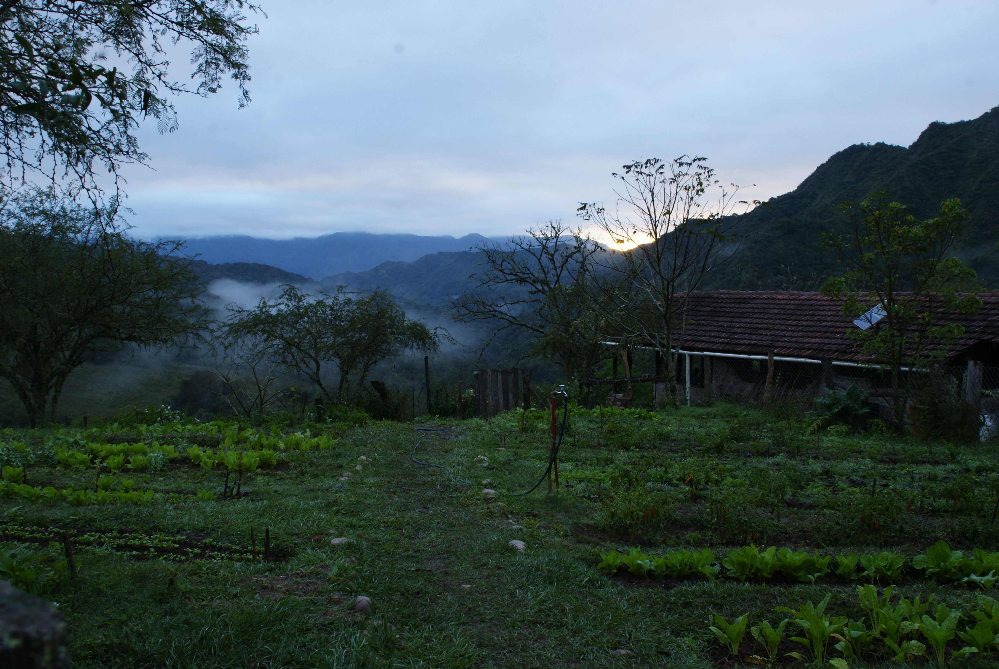
    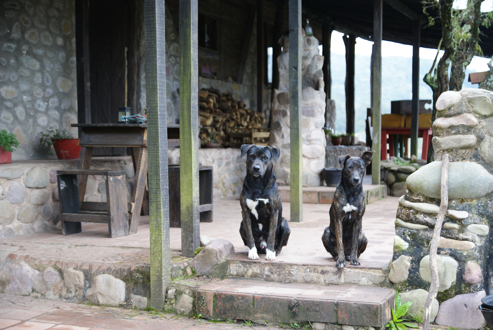
    
    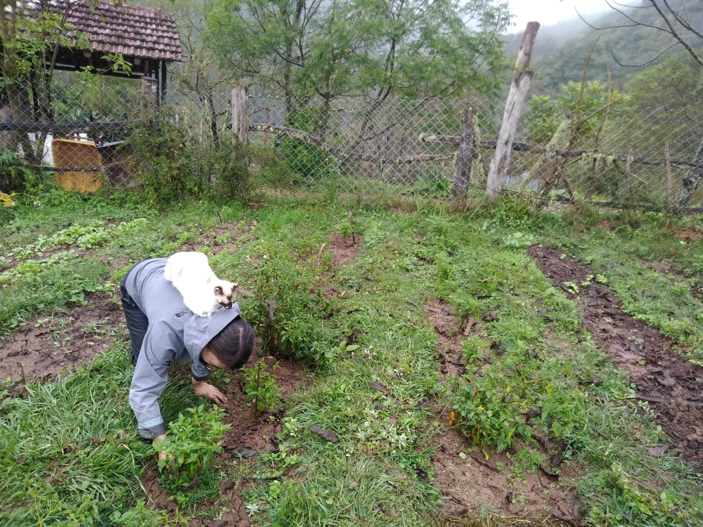
    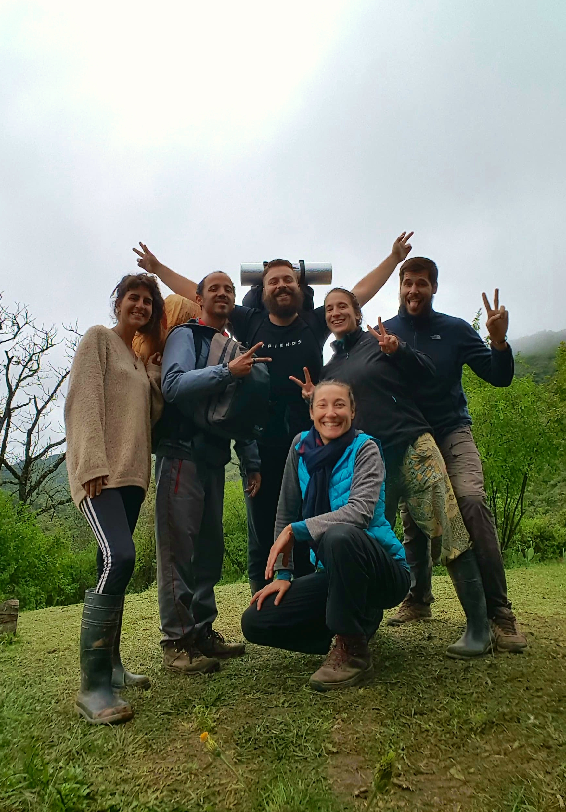
    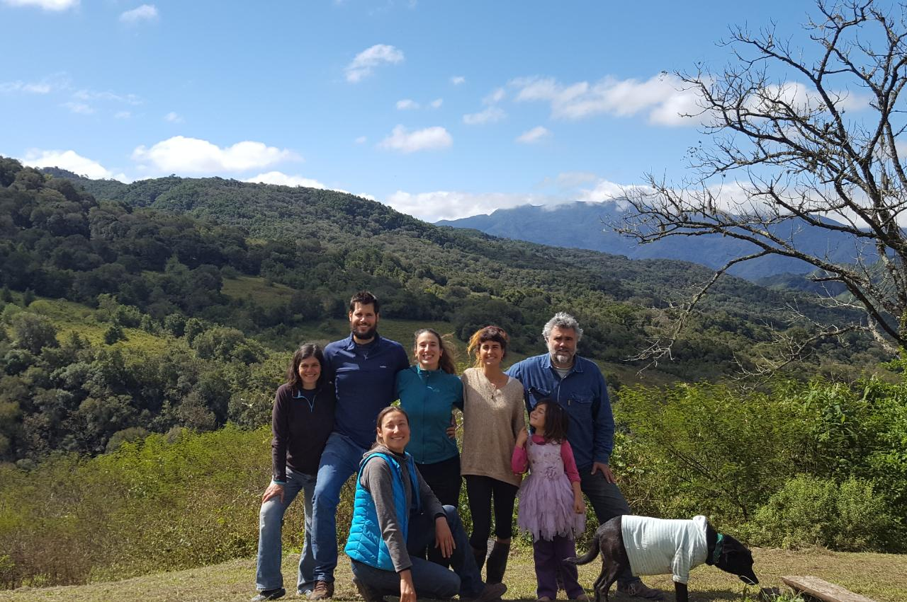
    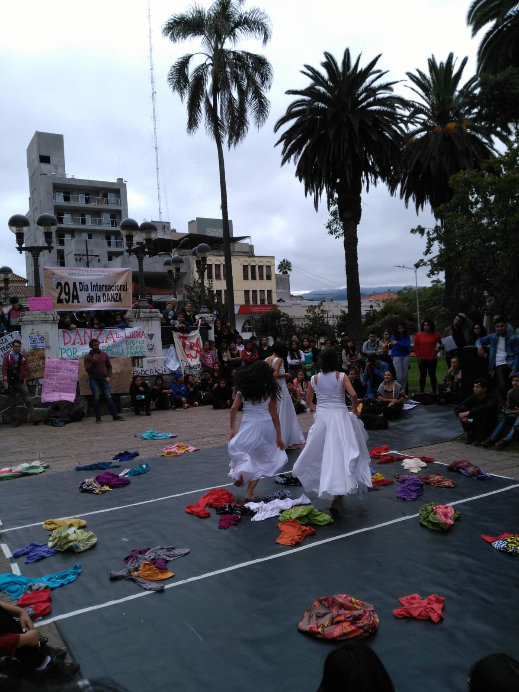
    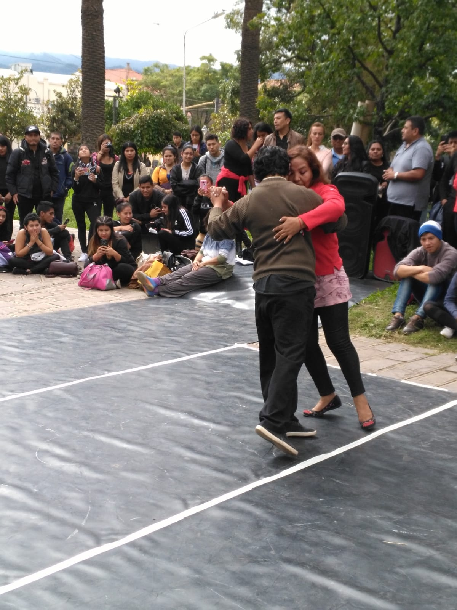
    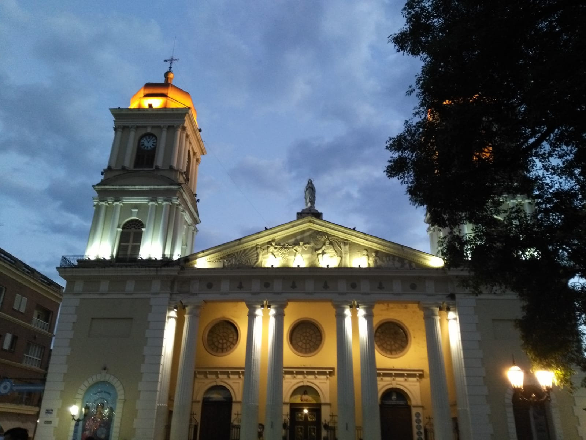
    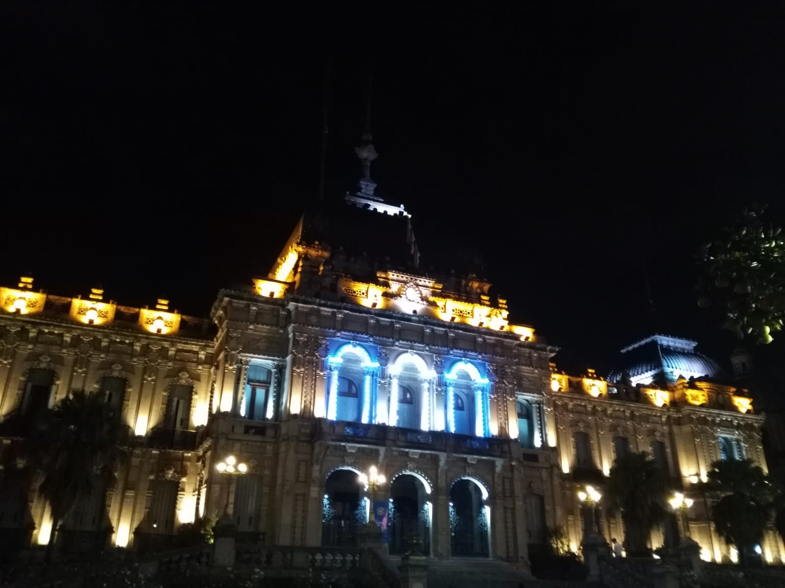
    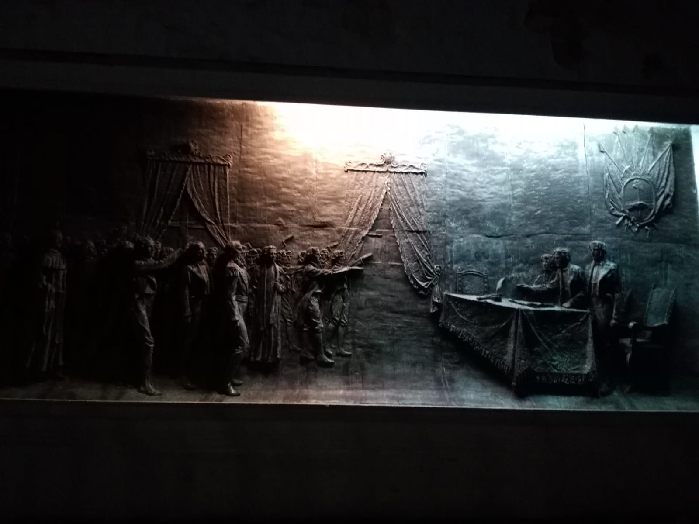
<\div>

