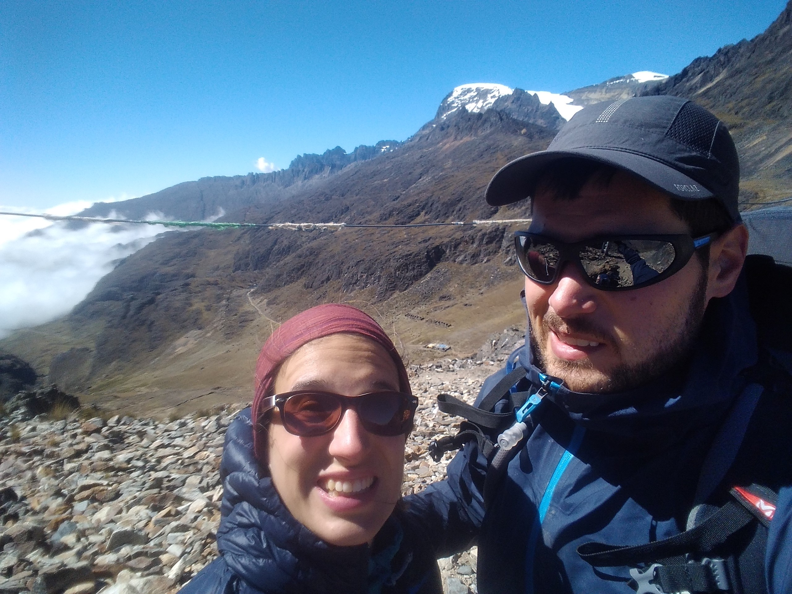

Title: Bilan Bolivie
Date: 2019-05-28 12:30
Category: Amerique du sud
Slug: BilanBolivie
Status: published
SubTitle: 
Cover: images/BilanBolivie/Cover.jpg
Thumbnail: images/BilanBolivie/Thumbnail.jpg

# Le bilan de la dame

La Bolivie ou le pays qui me faisait rêver depuis les photos de Cyril et Nath. Alors qu'en est-il ?

Tout d'abord un tour rapide d'horizon. La gastronomie n'est pas fofolle. On a cherché à y aller doucement sur les plats locaux car on nous avait averti en Argentine que parfois ça pouvait mal se passer. Et bien ça n'a pas loupé... J'ai été on ne peut plus malade pendant 8 jours. Donc raté ! Mais je pense qu'il est possible d'avoir une expérience plus paisible et même sympa car il y a plein de comedors (grandes salles à manger avec des stands), souvent au dessus des marchés. Et les avocats sont les plus crémeux qu'on ait jamais mangés. Donc expérience mitigée mais possibilité d'amélioration ! 

La condition des femmes n'est pas non plus à son top niveau, et il y a un regard assez critique sur le mouvement féministe argentin. Il y a également des réjouissances comme le mariage forcé dans certains villages et évidemment pas d'avortement. Encore des progrès à faire...

## Les boliviens 

La première impression qu'on a eu en passant la frontière a été très bonne. C'était le retour des habits tradi, et ce surtout pour les femmes. Partout, des jupes très bouffantes de plusieurs couches, des collants en laine colorée, et surtout chapeau. Les cholitas portent un petit chapeau melon sur le sommet de leur crâne qui leur donne une prestance folle. Droit sur la tête : femme mariée, incliné sur le côté : célibataire, en arrière : c'est compliqué (mieux qu'un statut facebook !). Et dès le premier terminal de bus, on rentre en contact avec une population qui se chahute, qui se poursuit en se marrant, qui se fait des blagounettes, bref des petits rigolos. 

Malheureusement pour nous, cette impression ne s'est pas poursuivie... On les a par la suite trouvé de plus en plus fermés et indifférents. Bien sûr on était passés par le Laos où les gens sont aussi indifférents au toursime. Mais là, on avait vraiment l'impression de les faire suer. Pas toujours facile donc. Et grosse déception car la perception du pays dépend pas mal de la population. Je pense qu'avec une expérience en volontariat cette sensation aurait été différente peut-être, mais nous n'en avons pas fait.

## Les paysages

Niveau paysages, à cause de mes intestins et du dos de Sylvain, nous n'avons pas pu profiter pleinement de la diversité bolivienne. Mais tout ce que nous avons vu nous a enchanté, étonné ou laissé bouche bée. A commencer par le salar d'Uyuni et le parc autour que nous avons traversé. En quatre jours, nous avons découvert des formations rocheuses improbables, des sources d'eau chaude et geysers, des étendues sur fonds montagneux et ce stupéfiant salar. C'était une tuerie, et quatre jours auxquels nous repenserons longtemps. 

Le trek de Takesi nous a aussi vraiment enchanté. Nous avons beaucoup apprécié son ambiance mystique avec ses brumes qui stagnaient dans la vallée. Sa jungle et ses paysages lunaires à l'ascension nous ont aussi beaucoup plu. 

Enfin, les villes. Potosi, nous l'avons survolé, mais dans la partie du centre, cela m'a semblé être une petite ville assez agréable, avec son architecture coloniale. Nous avons adoré Sucre. Et heureusement car nous y avons passé 8 jours à cause de notre santé fragile... les petites natures ! C'est une ville blanche, avec de très très beaux bâtiments coloniaux entretenus. Il y a une belle ambiance car nous ne nous sommes pas sentis envahis par le tourisme. La vie locale est bien présente et pas que pour le folklore. Nous avons donc passé du temps au marché, fait un tour guidé de la ville, et donc compris pas mal de chose sur la dynamique de la Bolivie.

Enfin La Paz... Une ville tentaculaire. On en prend d'autant plus conscience qu'elle est encaissée dans la vallée mais que chaque montagne autour est couverte de ces petites habitations en parpaings rouge. J'ai pas mal souligné l'architecture de Sucre, car en comparaison, dans le reste de la Bolivie, ce sont des maisons avec parpaings et ciment apparents. Et une impression d'inachevement. Avec parfois option fil éléctrique visible. Bref pas la joie. La Paz c'est un peu ça, mais tellement plus. C'est une ville fascinante, grouillante de vie, avec du vrai street art. Il y a des bâtiments très modernes, notamment cet hideux nouveau brureau présidentiel, et d'autres très décrépis. J'ai trouvé cette ville extra, il faut la voir pour le comprendre. 

## La politiuqe et l'ambiance générale

Même les guides les plus récalcitrants à la parole nous ont parlé de politique. Et ça à l'air catastrophique. De Uyuni à La Paz en passant par Sucre, tous dressent le même portrait. Evo Morales était un bon président, et même le premier président indigène et puis il est parti en cacahouète. Il arrivait juste après un président "gringo", puisque majoritairement éduqué et formé aux Etats-Unis. Evo a donc été très apprécié au début puisqu'il comprenait les problématiques des habitants du pays, grâce à ses origines indigènes. Il a commencé son premier mandat en nationalisant beaucoup d'entreprises, ce qui a beaucoup plu. Il a pris pas mal de bonnes mesures pour le pays, ce qui lui a vallu une réélection. Et là, c'est le drame. Sur les deux derniers mandats, il a monté une sorte de troisième pouvoir afin de contrôler les élections, il a mis tous ses amis à la tête des grandes entreprises, hôpitaux... Sans besoin de qualifications particulières. Les personnes ne votant pas pour lui sont interdites de travailler dans les institutions publiques, et comme une belle majorité des boites sont maintenant nationalisées... Notre première guide était vétérinaire et sa femme assistante sociale. Etant opposés au pouvoir, ils n'ont plus la possibilité d'exercer leur boulot. Il fait aussi beaucoupe de promesses pour acheter des votes. Promesse d'un nouvel hôpital, d'un nouveau stade de foot, d'une rénovation de route. Mais rien n'arrive jamais. Enfin, sa dernière action marquante est un référendum afin de savoir s'il y avait moyen qu'il se présente indéfiniment. La réponse a été bien évidemment non, et il s'est donc dit qu'il n'allait pas tenir compte du résultat de ce sondage. Mais comment appelle-t-on un président qui prend ce genre de décisions ? 

Bref voici un petit compte rendu de ce qu'on nous a raconté pendant ce périple bolivien. Pas jojo, sachant que les élections sont comme pour l'Argentine en octobre/novembre, le suspens est à son comble ... Croisons les doigts !

Voilà ce petit bilan sur ce beau pays mal dirigé !

# Le bilan du môsieur
Ah la Bolivie, tant attendue, tant fantasmée. Alors qu'en dire ?

Déjà y'a un truc qu'on ne peut pas enlever à ce pays, c'est la beauté de sa nature et de ses paysages. Et encore on en a vu qu'une partie. Mais c'était déjà incroyable. La petite expédition au salar d'Uyuni et du parc national avoisinant était vraiment folle. Mes yeux ne s'en sont toujours pas remis. Mais les autres lieux que nous avons fait ne sont pas en reste.  
Mention spéciale aussi pour Sucre où nous avons fait une bonne halte un peu malgré nous. La ville est vraiment très agréable et a beaucoup à offrir. Ce qu'il faut pour accueillir le touriste en mal de  bon café, mais avec quand même une vraie vie locales, notamment autour du marché.
La Paz, sans être un lieu incroyable pour moi, a quand même quelques coins sympas à voir. Et son cimetière rempli de street art m'aura enchanté.
Et le Takesi, magnifique trek sur deux jours qui m'a beaucoup plus. Ce chemin inca habité par la brume renvoit quand même une atmosphère indescriptible.
Surtout, venant de l'Argentine, j'ai quand même senti une culture moins occidentale, plus traditionnelle et locale. Et ça m'a bien plu.

Malheureusement le tout est entaché par de petits problèmes de santé. De dos pour moi, une intoxication alimentaire pour Maïlys. Dur dans ces conditions d'être sur un petit nuage. D'autant que ce dos nous a empêché de voir des lieux qui nous faisaient vraiment envie comme le parc de Torotoro. Je lui en veux quand même pour ça, à mon dos.

Enfin, autre petite ombre au tableau aussi, j'ai trouvé les boliviens globalement assez fermés. J'ai déjà fait mon petit laïus sur le sourire et comment ça peut vraiment changer la perception des gens et des expériences. Bon ben voilà encore un exemple, mais par la négation. Après trois semaines où les sourires se sont fait rares et où on avait l'impression de faire chier le monde en étant là, y'a comme une frustration qui s'installe obligatoirement. Alors oui il y a des exceptions, c'est certain. Mais contrairement au Laos par exemple, où on avait plus la sensation qu'ils s'en fichaient pas mal de nous, là on eu plutôt la sensation de les déranger vraiment. Ce qui n'est pas pareil et est bien dommage à mon sens.

Bon et y'a cette histoire de politique pourri, comme pour beaucoup d'endroit. Maïlys l'a expliqué en détail, je vais donc m'abstenir. C'est un peuple qui n'a pas toujours eu de chance avec ses présidents, et voilà qu'on a un dictateur en puissance qui pointe le bout de son nez. Cela commence à bien faire, de voir toujours les mêmes tocards au pouvoir, ici ou ailleurs. A croire que le pouvoir corromp ? 

<figure>
    
    <figcaption>On est sereins ou on est pas serein ?!</figcaption>
</figure>