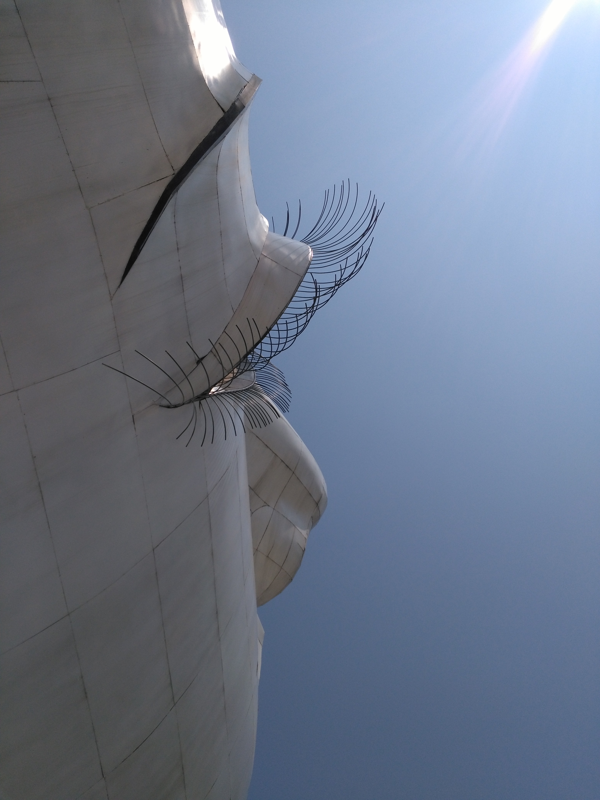

Title: Bilan de quatre semaines au Myanmar
Date: 2019-03-06 20:40
Category: Asie du Sud-Est
Slug: BilanMyanmar
Status: published
SubTitle: 
Cover: images/BilanMyanmar/Bilan_cover.jpg
Thumbnail: images/BilanMyanmar/Bilan_thumbnail.jpg

# Le bilan de la dame

Encore un bilan compliqué à écrire de part la complexité de ce pays, mais est-ce qu'il ne le sont pas tous ?

On est partis au Myanmar avec plus d'appréhensions. L'appréhension d'avoir des difficultés à passer la frontière. Elle a été très longtemps quasiment impossible à franchir, et elle ne l'est aujourd'hui qu'en peu de points pour les voyageurs. L'appréhension également du coup de la vie qu'on nous avait décrit comme beaucoup plus cher (ce qui n'était pas tout à fait vrai finalement). L'appréhension de se retrouver SDF. Après avoir beaucoup discuté avec Jérémy, un voyageur toulousain chevronné, nous avons compris la difficulté de la notion de logement. Les étrangers ne sont en effet autorisés que dans les hôtels habilités (et donc interdits dans les hôtels birmans). Il n'est pas possible de "rester dormir" chez quelqu'un, puisque chaque étranger qui passe la nuit quelque part doit être déclaré au gouvernement (à l'armée?...). Donc pas de couchsurfing, et très souvent les airbnb ne sont pas possibles pour peu de nuit étant donné que cette déclaration prend un tas considérable de démarches et de paperasse. Donc nous sommes rentrés dans le pays en se disant qu'il faudrait quoi ? Réserver absolument un hôtel chaque fois à l'avance pour ne pas tomber sur une structure trop chère (ou encore pire, sans aucune possibilité). L'appréhension également de cette junte militaire qui sévit selon les régions plus ou moins fortement. Et enfin l'appréhension de la nourriture qui est apparement horrible et très pourvoyeuse d'énormes soucis gastriques.

Bref la liste était longue ! Au final, les hôtels c'était facile, on a pas rencontré de militaires, on a eu aucun souci à la frontière et les tarifs n'étaient pas si délirants. Par contre... la nourriture ... On a souffert dans tous les sens du terme !

Mais ce petit bout de chemin ne se résume pas à ça. Déja parlons de sa population. Les habitants du Myanmar sont juste adorables. On a renoué avec des bonjours et les sourires à tout bout de champs. Ils sont en plus de ça toujours prompts à te filer un coup de main. Bon, on ne va pas se le cacher, ils sont aussi légèrement arnaqueurs sur les site ou le tourisme a frappé le plus durement. Mais à part ça, que du bonheur, c'est une population diversifiée qui gagne a être connue. Un grand pouce en l'air !

Au niveau religion, il y a toujours une grande population de moines, mais aussi une population non négligeable de nonnes. C'est le pays où nous avons croisé le plus de femmes dans les ordres. Petite note, et je me trompe sûrement, mais il me semble n'avoir vu que des moines en rouge bordeaux, alors que dans les pays voisins il y avait plusieurs déclinaisons de couleurs du orange au brun en passant par le rouge. Je n'ai pas pensé à poser de questions là dessus. Tu peux croiser des moines qui fument le cigare, des moines en scoot ou conduisant une voiture (parfois même une voiture de sport). Comme ils n'ont normalement pas le droit de conduire, ils sont appelés les flying monks (les moines volants pour ne pas dire qu'ils conduisent).

Second point très très positif : l'architecture. Je m'attendais à des bâtiments rongés par la moisissure après avoir papoté avec Aurélie. Mais en fait je me suis encore un peu emballée dans ma tête. Il ont de très beaux monuments (et je ne parle pas des monuments religieux, qui sont également très chouettes). Les immeubles et les maisons de ville ont du charme de l'ancien et ça, ça m'avait manqué. Ils semblent plein d'histoire et effectivement recouverts parfois d'une petite couche de "moisissure" noire qui leur donne encore plus de cachet. On dirait parfois des maisons de sorcières, et moi ce genre mi-glauque mi-mystérieux, j'a-do-re !

Après cinq mois d'Asie, on se disait qu'on commençait à avoir notre lot de cascades, temples ... Mais les paysages au Myanmar sont différents, et m'ont beaucoup plus par leurs couleurs, diversité et les scènes de vie qu'on y a vu. Et on a eu le temps de les voir défiler, notamment dans les transports, car de ce point de vue c'était comme au Laos. Tu peux mettre 9h pour faire 200 km. On a aussi expérimenté le train, et c'était absolument génial ! Passer toute la journée avec la tête à travers la fenêtre ouverte à regarder les paysages qui défilent et faire coucou aux enfants qui courent le long des rails. Parfait !

Par contre on a eu chaud mais chaud... Notamment à Hpa-An, Bagan et Moulein... C'était épuisant. Et ça combiné avec la nourriture qui le plus souvent baigne dans une huile moyennement fiable ... La recette parfaite pour la turista.

Enfin, encore un gros coup de coeur pour le volontariat qu'on a fait. L'ambiance, les locaux et les volontaires, l'environnement, et l'esprit du projet étaient enthousiasmants.

Un immense coup de coeur pour le Myanmar donc, qui marque en beauté la fin de notre périple en Asie. Ce qui est sûr, c'est qu'on en est ravis !

# Le bilan du monsieur
Nous voici à l'heure du bilan sur le Myanmar. Et ça va être laborieux tant je tient à rendre justice à ce pays, que j'ai beaucoup aimé.

Déjà nous partions avec un a priori dessus, essentiellement lié aux infos internationales que l'on peut avoir depuis la France. Sans dire que ce qui nous ai reporté est faux, ça ne dépeint clairement pas fidèlement le quotidien de beaucoup des habitants de ce pays.  
De quels a priori je parle ? Celui d'un pays fermé, tenu d'une main de fer par la junte militaire autoritaire et omniprésente, capable du pire (le cas des Rohingas, et bien d'autres malheureusement). A priori renforcé quand on apprend que des régions entières du pays sont fermées au tourisme, le fameux triangle d'or de l'opium par exemple. Le Myanmar a longtemps été le premier producteur d'opiacé au monde (dépassé depuis quelques années par l'Afghanistan), et c'est certainement une source de revenus primordiale pour la junte. Donc là, on s'attends limite à croiser des milito-fonctionnaires zélés et capricieux exerçant leur petit pouvoir un peu partout. Je grossis le trait, mais à peine dans ma tête.

Alors bien sûr, on a soigneusement évité les zones à risque. Mais la réalité dans les endroits ouverts au tourisme est on ne peut plus éloignée (sans verser dans la naïveté non plus).

Déjà, et c'est un point remarquable, les gens sont très souriants et foncièrement gentils. Je crois qu'on minimise souvent l'importance que l'état d'esprit des locaux ont sur l'expérience d'un séjour. Il est tellement agréable de visiter un pays où les gens sont juste souriants. Et encore plus lorsqu'ils sont gentils et heureux de rencontrer d'autres gens. Je ne suis pas la personne la plus souriante, et je me rends maintenant compte que j'ai par le passé minimiser l'importance des sourires. Quand on débarque, parfois fatigués, un peu perdus dans un lieu qu'on ne connait pas encore, avec une langue et une écriture qu'on ne maitrise pas, les sourires sont vraiment le petit miel qui adoucit l'experience.  
Il me semble aussi que les locaux sont souvent très contents de voir des touristes, voir curieux parfois. La France leur semble un tout autre monde (ils ont pas tout à fait tord). On pourrait penser que c'est parce que certains lieux sont ouverts aux touristes depuis peu, qu'ils ne sont pas encore blasés. Mais ici comme dans le reste de l'Asie du sud-est, avec un smartphone dans chaque main et des antennes 4G un peu partout, croyez-moi, ils sont complètement ouverts sur le monde. Donc ils savent. Je pense qu'ils ont encore le goût du contact humain surtout, de la petite discussion de café ou de bus. Et même avec une langue qui nous sépare, certains redoublent d'efforts pour sortir quelques mots en anglais. Ou appelle des jeunes à la rescousse.  
Bref une population avec un contact vraiment très agréable et plaisant, et une myriade de sourire (Thaïlande attention, tu as de la concurrence). Bien sûr, comme partout, on a pu croiser quelques personnes plus bourrues, plus arnaqueuses, mais cela reste très anecdotique.

Quant au fait que le pays soit fermé et difficile à voyager, rien n'est plus faux. Les lignes de bus sont très bien faites, le train aussi. C'est vrai que les routes sont pas forcément dans le meilleur des états donc ça prend du temps, mais tout est très bien indiqué.  
Et les hôtels très faciles à trouver. On avait lu qu'il fallait absolument trouver des hôtels pour touristes, autorisés à acceuillir des étrangers, que c'était pas toujours facile, ect. Je pense que le pays à assoupli la règle, parce que l'offre est vraiment vaste et on est parfois tombés dans des guesthouses assez simples. Peut-être que c'est encore une réalité dans les endroits plus reculés et moins visités.

En terme de visite et de culture, clairement on a bouffer du bouddha. C'est vraiment la première religion ici. On a croisé quelques templs hindous, des mosquées aussi, et bien sûr quelques églises du fait de la présence des anglais pendant un temps. Mais les habitants sont ici très fervents, et les temples et autres lieux religieux sont très fréquentés par les locaux, qu'ils soient par ailleurs touristiques ou pas.  
Et ce qui m'a frappé ici plus qu'ailleurs peut-être, c'est la vie qui s'organise autour des temples. Contrairement à ce que j'ai pu voir dans les pays occidentaux (religion chrétienne), et même quelques lieux musulmans, ici les gens viennent vraiment passer la journée au temple. Genre littérallement certains pique-niquent dans le temple. Bien sûr avec des prières et des offrandes à Bouddha. Après c'est vrai qu'aussi, au vu du climat plus chaud, ce sont de fait des lieux plus ouverts sur l'extérieur, contrairement aux bâtiments bien fermés des régions plus tempérées. Mais c'est marrant lorsqu'on visite un temple le dimanche de croiser des familles assises par terre dans un coin avec tout l'attirail de bouffe étalé devant eux.

J'ai peut-être eu moins de moment "wouhahou" devant un paysage ou un édifice que pour les autres pays. Ma préférence allant sans doute du côté des environs de Hpa An où certains points de vue valent le détour, ou les couleurs des champs en allant vers Pindaya. Et Bagan, même si c'est assez redondant, reste quand même impressionante par son étendue et le nombre de ses bâtiments. Je repars même un peu frustré de pas avoir eu plus de temps pour aller jusqu'à Mandalay, de pousser un peu plus dans la campagne ou même de flâner un peu plus dans Yangon. Mais on avait que 26 jours, il a fallu faire des choix.  
Le moment le plus remarquable restant bien entendu notre volontariat dans l'association Mudita au monastère Htet Ein Gu, à côté de Nyaung Shwe. Remarquable par son intensité (les journées étaient bien remplies, les rencontres nombreuses) et son authenticité (avec les enfants et les encandrants birmans). Je n'ai pas beaucoup plus à dire que ce qui a déjà été mentionné dans <a href="Mudita.html">l'article le concernant</a>. Je recommande juste, si vous avez le temps, de vous arrêter un temps dans le voyage pour de telles expériences. Le mouvement se stoppe, mais notre vie en terme de rencontre, d'expérience et d'energie prend un sacré coup de boost !

Voilà, je ne vais pas m'étaler plus. Venez visiter ce pays, ça vaut vraiment le coup ;).  
Myanmar, Birmanie, peu importe ton nom, tu nous auras fait terminer cette parenthèse de l'Asie du sud-est de la plus belle des manières. Merci, et à bientôt ! Car crois-moi, je reviendrai, tant il me reste de chose à découvrir ici !

