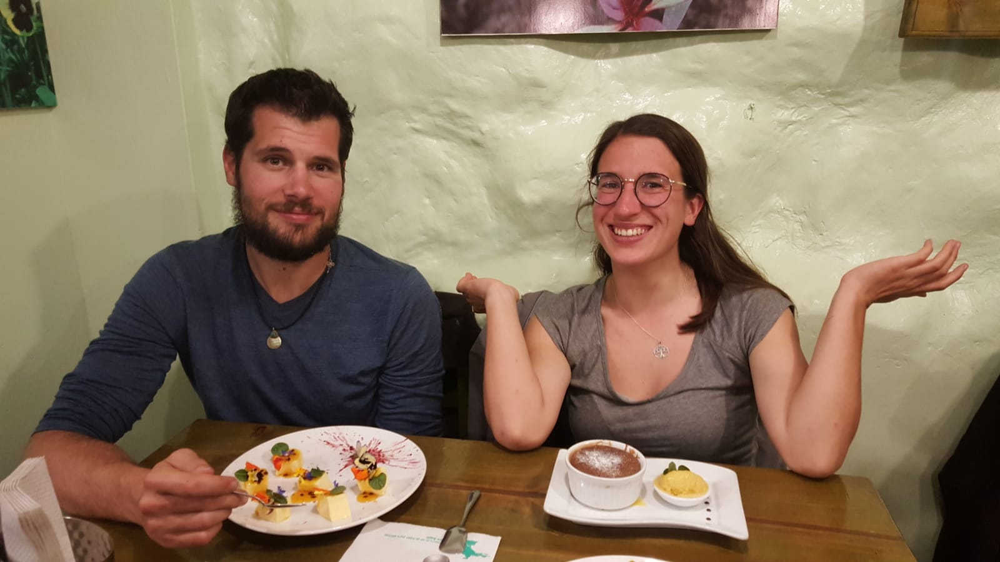

Title: Pérou, le bilan !
Date: 2019-07-14 13:23
Category: Amerique du sud
Slug: BilanPerou
Status: published
SubTitle: Lamas, ruines et ceviche
Cover: images/BilanPerou/cover.jpg
Thumbnail: images/BilanPerou/thumbnail.jpg

# Le bilan de la dame

J'ai adoré ce pays, ou plutôt le peu que j'en ai vu. Et ce coup de foudre est très largement mélé avec une énorme frustration. On approche dangereusement de la fin de notre périple, et puisqu'on nous a chaudement recommandé l'Equateur et la Colombie, nous avions décidé d'y consacrer respectivement un mois pour chaque pays. Ce qui signifiait un séjour un peu écourté au Pérou qui est un pays gigantesque ! On a donc finalement vu assez peu de l'énorme diversité que propose ce territoire, et on a en plus consacré un peu de notre temps à du volontariat (ce qui raccourcit encore plus le temps pûrement touristique). Il n'y a qu'une seule conclusion, il faudra y revenir, et y revenir longtemps ! Retour sur ces quelques semaines péruviennes.

La gastronomie, pour ma part ça a été le retour vers l'expérimentation confiante. Après les grosses difficultés boliviennes c'était un plaisir de lâcher la bride. On a notamment commencé à manger des ceviches, qui sont des plats à base de poissons et/ou fruits de mer crus marinés dans du citron essentiellement. Un délice (quand le poisson est frais...), et on en trouve un peu partout en Amérique du sud ayant une côte (n'en parlons pas aux boliviens, sujet sensible). On est aussi retourné vers la cuisine locale locale, avec les marmittes préparées par les mamas dans la rue. Vive la streetfood péruvienne (même si des fois tu te retrouve avec des trippes chelous sans l'avoir vu venir)!

Les paysages, du peu qu'on en a vu, étaient top et diversifiés. Ce qui est assez normal vu la taille du pays. Les bords paisibles du lac Titicaca, les belles villes coloniales d'Arequipa et de Cusco, le canyon gigantesque de la Colca, les dizaines de sites Incas et préIncas autour de Cusco, la vie de village à Ttio, et enfin le majestueux Machu Picchu : on est pas près d'oublier. 

Les gens sont tellement mais tellement sympas. De toute façon l'impression exagérée et pas toujours justifiée, c'est qu'après avoir quitté la Bolivie, même un bernard lhermitte te paraît avenant. Toujours plus d'exagération. Non mais on a eu un super feeling avec les péruviens, et ce dès notre passage de frontière. Ils sont supers communicatifs, souriants, aidants, bref le contact est facile. 

On a aussi fait de super rencontres de voyageurs, notamment notre team de chez Luis. On s'y est vraiment sentis comme à la maison mais avec plein de copaings.

Bref le coup de coeur ! Et inattendu, car je pensais vraiment que ça allait juste être un pays sympa sans plus, très touristique, qui ne nous resterait pas forcément en tête : FAUX. 

Pérou, on reviendra, il nous manque tant de choses à découvrir !

# le bilan du monsieur

Alors le Pérou, c'est pour moi un peu ce que j'attendais de la Bolivie, les ruines Incas en plus. Pourquoi ?

Déjà il a fallu qu'on passe la fontière pour voir les gens s'ouvrir un peu plus. Mais littérallement, à quelques kilomètres j'ai vraiment était étonné (et agréablement surpris) du changement d'attitude. Après une petite discussion avec Marissa, elle nous expliquera que les boliviens sont des Aymaras et que côté péruvien, ce sont des Quechuas, beaucoup plus ouverts. Je crois que cette distinction est surtout vraie autour du lac Titicaca, mais je l'ai ressenti sur l'ensemble de ces deux pays.  
Donc oui les péruviens sont très gentils, avenants, curieux et disponibles. Les exemples ne manquent pas pour moi, mais je ne tiens pas à revenir dessus sur le bilan. Lisez nos articles ;)

Ensuite il y a ces paysages. On a vu des volcans à côté d'Arequipa, le fameux mais vraiment sublime lac Titicaca, les montagnes autour de Cusco, la vallée sacrée et le canyon de Colca. Et le Machu Picchu, incroyable. Et tout ce que j'oublie. Et les sites incas. Alors certes en visitant Cusco on en bouffe pas mal, c'est parfois difficile de s'extasier une énième fois, mais j'ai vraiment beaucoup apprécié la culture incas. Le peu que j'en ai appris en tout cas. Et toute l'iconographie, l'esthétisme et les légendes. Clairement c'est une culture très intéressante, faite d'agrégats et d'assimilations des sociétés que les incas ont conquises. Dur de dire ce qui vient d'où, ce qui a été gardé, récupéré, rejeté ou oublié. Mais les incas assimilaient les communautés qu'ils conquièrent. Mise en miroir du comportement des espagnols à leur arrivée, on peut quand même se demander si justement on avait pas à apprendre de cette civilisation, plus que ce qu'elle nous a laissé.

Et comme dans tout voyage, ce fut aussi le lieu et le moment de belles rencontres. Les petits français du canyon de la Colca, autant en manque de fromage que nous, ou tout les gens du volontariat. Mention spéciale à Shane avec qui j'ai eu quelques bonnes discussions. Un exemple de rencontre où tout en étant très différents sur la situation, le parcours ou les idées, on a pu vraiment échanger en toute bienveillance. Merci l'ami ;)

Et malheureusement c'est aussi le pays de la frustration. Peut-être plus que les autres. Le pays est grand, le pays est bien, et nous n'en avons fait qu'une petite partie, privilégiant une étape conséquente à Cusco plutôt que d'enchaîner les visites. Du coup, on a pas enchaîner les visites (:D) et il y a énormément de choses que j'aurais aimé voir. Mais ce sera pour un autre voyage. Car oui Pérou, je t'ai beaucoup apprécié et je compte bien te connaître encore plus. A la revoyure !

<figure>
    
    <figcaption>Elle est pas belle la vie ??</figcaption>
</figure>