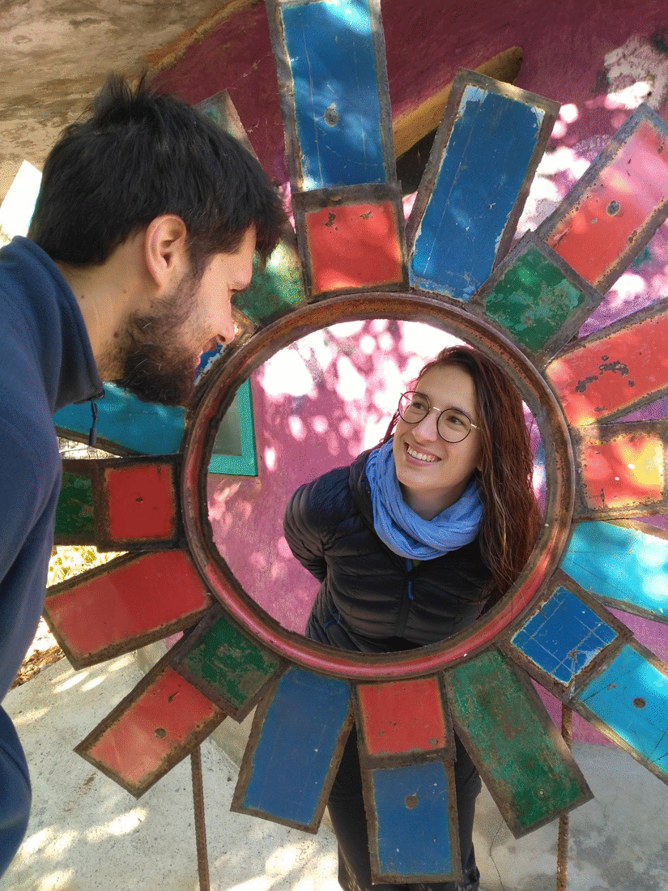

Title: Bilan de six semaines en Thaïlande
Date: 2019-02-20 20:40
Category: Asie du Sud-Est
Slug: BilanThai
Status: published
SubTitle: 
Cover: images/BilanThai/KohLantaMook_24.jpg
Thumbnail: images/BilanThai/BilanThumbnail.jpg

# Le bilan de la dame

Alors la Thaïlande, vaste sujet ! Qu'est ce que j'en retire ?

Je me souviens d'un premier a priori assez moyen. Passer du Laos en Thaïlande, j'ai eu l'impression de perdre toute forme d'authenticité. Il faut dire que notre premier aperçu s'est fait à travers les vitres d'un bus pendant 24h... L'i-dé-al ! En descendant direction le grand sud, j'ai pris dans la tronche mon imaginaire du capitalisme le plus débile : des Mac Do, Dunkin Donnuts et Starbucks tous les 20 mètres. Bon peut être que j'exgère un peu sur la distance et peut être que une fois le choc de la transition commmunisto-capitaliste passé, j'ai réalisé, que c'était tout simplement un pays plus "moderne".

## Le sud 
Hé bien le sud, on l'a beaucoup vécu avec Rémy et Aurélie, et avoir ses amis avec soi en voyage, y'a pas photo c'est génial. Pour ce qui est de Koh Lanta et surtout, surtout Koh Mook, on a été agréablement surpris du petit nombre de touristes pour la haute saison. On y a passé de chouettes moments et il reste beaucoup de coins bien préservés, ce qui nous a fait plaisir. Par contre ... Krabi et Ao nang : qué cata ! (ce commentaire n'engage que moi, Sylvain vous fera part de ses impressions). C'est comme une côte d'Azur mixée avec Disneyland mais en mille fois pire (toujours plus excessive la nana!). Des restos aseptisés en goût et en ambiance pour rentrer dans le moule de ce qui plairait aux occidentaux, des boutiques souvent similaires : tout ce qu'on aime. Et le fait qu'on y ait été coincés de force par Pabuk n'a pas arrangé les choses. Peut être qu'on est passés à côté de l'authenticité du lieu. 

## Bangkok
Alors je suis assez surprise de dire ça, mais j'ai beaucoup aimé. C'est gigantesque, blindé de monde et pollué, mais il y a vraiment des quartiers et des marchés sympas et dans leur jus... qui cotoient de gigantesques et ultramodernes malls (centres commerciaux). Comme partout en Thaïlande, on y mange bien. Bref un pouce en l'air pour Bangkok !

## Le nord
Tout d'abord Chiang Mai, la ville adorée des touristes. Les marchés qu'on a fait, les réputés du samedi et dimanche, étaient blindés d'occidentaux, avec toujours une offre orientée touriste. Certains quartiers sont sympas, mais je n'ai pas eu de véritable coup de coeur. Et elle est également réputée pour ses temples, qui sont très beaux, toujours dans une architecture qui ressemble aux temples laotiens. Mais la vérité, et c'était prévisible, c'est qu'après plus de 4 mois en Asie, nous n'avons plus l'oeil ému par ces lieux de culte. Ou par une n-ième statue de Bouddha, si belle soit elle. Et c'est bien dommage. Par ailleurs nous sommes tombés sur une partie de temple interdite aux femmes, ce qui m'a mis en colère. Le bouddisme me paraissait être une religion plus toélrante que les autres envers la gente féminine avant de débuter notre parcours. Que nenni ! Tout un tas de restrictions pèsent sur les femmes également. Qu'elles soient vestimentaires, sur le nombre supérieur de règles à suivre notamment quand tu es moinesse, sur ta présence possible dans un lieu de culte ou pas en fonction de ton cycle menstruel... De mon microscopique aperçu du bouddisme, la conception de la femme est aussi archaïque que chez ses consoeurs monothéistes.

Bref on s'égare ! Donc Chiang Mai, juste un demi pouce en l'air, mais je pense que cette ville doit regorger de possibilités de formations notamment artistiques, médicales et méditatives. Elle est par ailleurs dynamique et possède des quartiers athentiques avec moins de touristes comme le quartier chinois.

Les deux boucles scooter nature que nous avons fait dans le nord, et toutes les rencontres à cette occasion récoltent plusieurs pouces en l'air. La nature est belle dans ces coins là et les rencontres avec les moines m'ont énormément plu !

Pai m'a paru moins hippiebobo que ce a quoi je m'attendais en entendant d'autres voyageurs en parler. Yahou ! Et Sukhothai, chouette, très beaux sites, belle ballade à vélo pour y arriver... MAIS ! Tellement chaud ...

Bon et pour finir, comme vous l'aurez compris dans mon article <a href="Pui.html">volontariat</a>, j'ai a-do-ré cette expérience.

Voilà je laisse Sylvain vous donner ses impressions!

# Le bilan du monsieur
Ah la Thaïlande, terre de contraste et de ... oups désolé je m'égare.

La Thaïlande, que dire ? Déjà, il faut bien comprendre qu'après le Laos, on passe à une autre ambiance. Le pays est plus riche, plus développé, plus ouvert à la mondialisation. En un sens on retrouve certains de nos repères (les fastfoods ou cafés cités par Maïlys, ou les convenient stores ouverts 24h/24 7j/7). Et bien entendu les gens sont aussi bien plus habitués aux touristes: ils parlent anglais généralement, il y a des endroits pour poser des questions, on peut toujours à peu près faire les trajets que l'on veut. Bref, c'est facile de voyager par ici !  
Le revers de la médaille, bien sûr, c'est que tout est plus mercantile aussi. Beaucoup de magasins pour les touristes, d'activités pour les touristes, de restaurants pour les touristes, etc. C'est ni bien ni pas bien, il faut si faire, on est plus dans un ancien pays communiste au passé de colonnies. Le royaume de la Thaïlande a su esquiver les invasions et a très vite traité commercialement avec l'occident. Ca se sent, voilà tout.

## Les îles du sud
On a donc commencé avec le sud, les îles, Koh Lanta, Koh Mouk et tutti Koh ti. On y a retrouvé nos amis Aurélie et Rémy gentillement venus passer les fêtes de fin d'année avec nous. Du coup autre contraste, on passe des montagnes vertes et fraîches du nord du Laos aux îles touristiques du sud de la Thaïlande. Mais ça nous a fait du bien. Il faut un temps pour tous, et quelques jours peinards à papoter sur la plage et boire quelques bières en fin de journée en bonne compagnie a quand même un côté pas dégueu... on va pa se plaindre quand même ! Petit retour à la bouffe occidentale aussi, beaucoup plus présente et accessible ici. Parfois un petit retour aux racines fait plaisir ;)  
Du coup j'ai été positivemment surpris par Koh Lanta, que je pensais plus touristique. Oui elle l'est, mais ça va. Ma préférence ira bien sûr à Koh Mouk, une île très paisible sur laquelle on aura eu des moments très sympas (je garde encore un souvenir ému du Panang curry au Hilltop restaurant).
Trang, Krabi ou Ao Nang m'auront laissé plus indifférent, mais y'a toujours de quoi s'occuper quelques jours.

## Bangkok
Ensuite on est allé à Bangkok. Première fois où je fous les pieds dans une mégalopole comme celle là. Impressionnant. Et si certains pourraient avoir peur de cette écrasante urbanité, j'y ai trouvé un côté vraiment intéressant, avec tout un tas de truc à voir, de coins très sympas, d'atmosphère différentes dans un espace si restreint. En bref, à faire !

## Chiang Mai et le nord de la Thaïlande
Un peu déçu, je ne savais pas trop à quoi m'attendre. Il y avait aussi à ce moment chez moi une petite lassitude du voyage. Certains manques se faisant plus présents (la famille, les amis, mes petites habitudes à Toulouse). Heureusement, on est ensuite allés chez Pui pour un volontariat, et se poser 2 semaines a vraiment permit de recharger les batteries pour la suite.  
J'ai vraiment pu apprécier le petit tour de scooter entre Pai et Mae Hong Son, de très beaux paysages et un bon feeling.

## Sukhothai, la dernière étape
En bref, des temples et de la chaleur, et des gens très gentils.

En bref, la Thaïlande, si elle ne sera pas ma préférence dans ce voyage de l'Asie, aura quand même été l'occasion de belles rencontres, de beaux moments et surtout une possibilité de voyager plus facilement, nous laissant souffler un peu.

Ah et aussi, c'est vrai, les gens sont plutôt souriants ici !

Et bien sûr, comme tout le monde le dit, une bien bonne gastronomie ;).

Ah, et bizarrement les thaïlandais ne sont pas très rassurants avec leurs voitures, on a l'impression qu'ils ne savent pas trop ce qu'ils font.

Voilà pour moi, la bise à tous !

