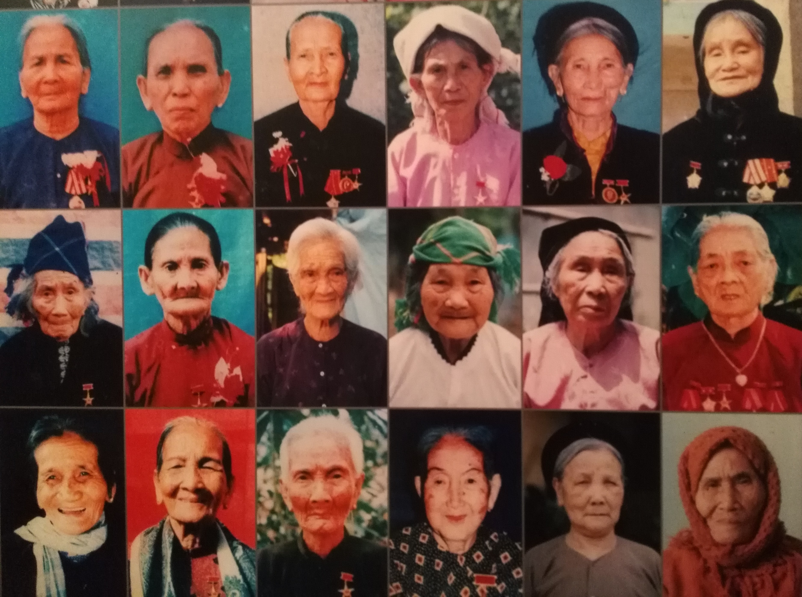

Title: Bilan de 4 semaines au Vietnam
Date: 2018-12-03 10:40
Category: Asie du Sud-Est
Slug: BilanVietnam
Status: published
SubTitle: On fait l'bilan, calmement, en s'remémorant chaque instant...
Cover: images/BilanVietnam/BilanViet_cover.jpg
Thumbnail: images/BilanVietnam/BilanViet_thumbnail.jpg

# Le bilan de la dame
... parler des histoires d'avant comme si on avait 50 ans.

Le Vietnam donc. Deuxième étape de notre petit périple. On commence un peu plus à savoir ce qu'on veut ou pas, et ce qu'on attend de ce voyage.

Le Vietnam c'était vraiment l'étape que Sylvain attendait, et sur laquelle j'avais plus de doutes. Et pourtant ... 

Je n'arrive pas vraiment à qualifier l'effet global que m'a fait le Vietnam. En y repensant, par rapport à l'Indonésie, et surtout Bali, je dirais moins bisounours. Comme si le Vietnam me paraissait plus cru, peut-être un peu plus dur, moins tape à l'oeil mais plus authentique. En tout cas c'est comme ça que je l'ai perçu je pense.

Les grandes villes qu'on a pu traverser sont grouillantes de vie, c'est un bordel phénoménal sans nom. Entre la circulation (mais qui est encore différente de celle de l'Indonésie), les boutiques qui t'attrappent l'oeil et parfois les naseaux, les gens qui sont partout, ça m'a donné une impression de vie type fourmilière. C'est complétement fascinant de se retrouver au milieu de tout ça.

Les gens m'ont paru à première vue moins souriants, mais au final on a plus réussi à tisser des liens avec eux. A commencer par les colloques à Ho Chi Minh, avec lesquels on a pu partager pas mal de repas et de moments bien sympas. Ils nous ont fait découvrir le Ho Chi Minh way of life. Et franchement, j'ai toujours pas pigé quand ils allaient à l'université dans la semaine. Ensuite, Hoan, notre easyrider qui nous a ouvert les portes vers l'interaction avec les vietnamiens. Déja c'était très chouette de passer du temps avec lui (oui je l'ai déja dit), et très chouette de pouvoir découvrir et parler avec tous les gens qu'il nous a présentés. Mais il nous a également appris pas mal de vocabulaire en vietnamien, et ça, c'est le pied pour débuter une conversation. Globalement, les vietnamiens qu'on a rencontrés, on a vraiment eu de belles interactions avec eux, et ça, ça fait plaisir !

Bon je ne vais même pas me lancer sur la gastronomie, parce que c'était juste parfait et diversifié ! 

J'ai beaucoup aimé le fait que même dans les lieux hautement touristiques comme Hoi An ou Ninh Binh, on ait pu faire des heures de vélo sans croiser de touristes. En fait, j'ai juste beaucoup apprécié nos ballades à vélo. 

Et enfin, ce qui m'a vraiment fait apprécier le Vietnam, c'est tout ce que j'en ai appris. Que ce soit sur son histoire, sa culture, la condition de la femme, les ethnies, les plantes... J'ai vraiment eu l'impression de mieux comprendre et donc de beaucoup plus apprécier ce qu'on découvrait.

En fait, je peux dire que j'ai adoré ce pays, mais je vais laisser le Monsieur vous en parler avec ses propres mots !

# Le bilan du monsieur
Voici venu le temps du bilan. On a passé 1 mois au Vietnam. J'avais vraiment envie de voir ce pays, et c'est chose faite. Je me couche donc un peu plus heureux sur les 30 ans de ma vie.

Déjà, d'un point de vue général, j'avais moins d'idées reçues sur ce pays. Ou alors je m'en faisais une idée moins éloignée de ce que c'est. Donc je crois que j'y ai trouvé à peu près ce que j'attendais. Mais ça n'enlève en rien au plaisir que j'ai eu, car oui, j'ai adoré ce pays. L'expérience globale de ce mois, quand j'y repense, me fait me sentir bien. C'est un pays à la fois grand (faut se taper le Nord-Sud), avec une diversité incroyable, mais qui renvoit une impression d'unité plus forte que l'Indonésie par exemple. Alors même qu'il y a eu une fracture Nord/Sud dans l'histoire du pays, je n'ai pas vraiment ressenti ça de mon point de vue de touriste. Et certes il y a tout un tas de minorités ethniques, avec leur propre façon de vivre, mais j'ai trouvé que globalement les villes, villages, les maisons et routes vietnamiennes ont un peu la même identité. On sent toujours le Vietnamien. Sans parler des différents cultes, puisque la population est en majorité bouddhiste avec quelques églises et mosquées de ci de là. Rien à voir avec le changement qu'on a pu vivre entre Java et Bali par exemple.

Maintenant le peuple vietnamien. Encore une fois je suis conquis. On a eu de très belles rencontres dans ce pays, les gens étant généralement gentils et bienveillants. Je pense à notre petite colloc' d'Ho Chi Minh ville, ou Hoan qui nous a tant appris sur son pays. Certes parfois quand le lieu est touristique, la relation est essentiellement marchande, mais tout de même en parlant quelques mot de vietnamien (teeeeellement dure comme langue), si on se fait comprendre, on a le droit à quelques rigolades. Je crois que souvent ils se moquent de nous et notre accent, mais bon, un peu de rire fait toujours plaisir.  
Difficile par contre d'oublier que c'est un peuple qui a beaucoup souffert au siècle dernier, enchaînant les guerres pas jolies, et les stigmates sont toujours là. Maintenant le pays est bien reparti, l'économie semble florissante (notamment à Ho Chi Minh), creusant de fait les inégalités. Beaucoup de pauvres, peu d'ultra riches.

Enfin, le pays a tellement à offrir. Entre les villes fourmillantes, la campagne tranquille et les paysages grandioses. La baie d'Halong et sa voisine Ninh Binh sont vraiment magnifiques. L'arrière pays du centre réserve aussi de sacrées surprises, je garde un bon souvenir tout de même d'Hoï An, de Hué et surtout de ce bon roadtrip qu'on s'est offert. Et même Ho Chi Minh, si étouffante, m'a laissé un souvenir plaisant, c'est dire. On a encore tellement à voir ici, je pense qu'on reviendra. Et pour finir, la nourriture vietnamienne est vraiment bonne, beaucoup plus diversifiée qu'en Indonésie, il y en a pour tous les goûts. Et en bon français que nous sommes, la bouffe c'est quand même important pour nous ! Et ce café si particulier, au filtre, très fort que j'ai quand même fini par apprécié (la claque après le café léger de l'Indonésie).

Du coup Vietnam, ce fut une sacré rencontre. J'ai vraiment apprécié passé ce mois avec toi. Tu ne m'as pas tout montré, du coup il faudra que je revienne probablement. Mais ce sera pour une autre histoire, maintenant je pars voir ton voisin le Laos. La bise !

