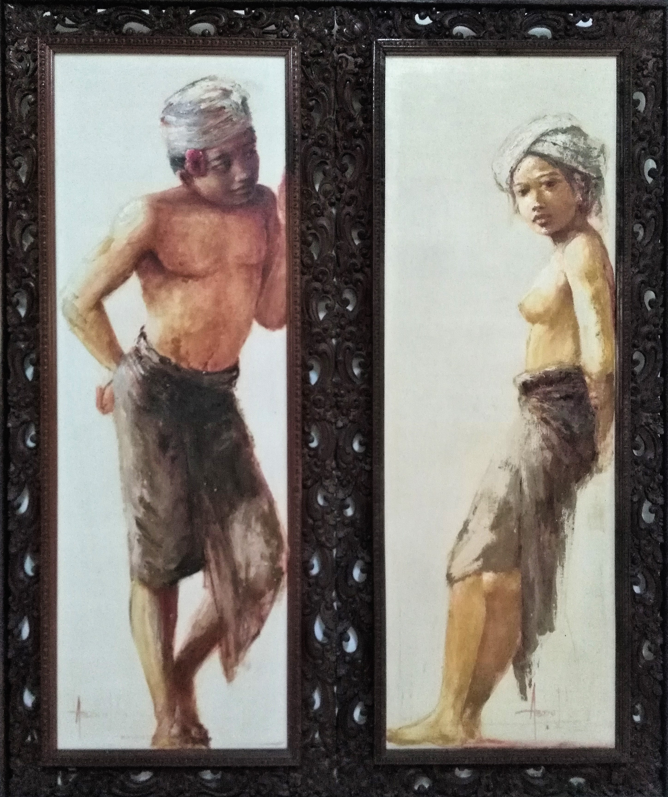

Title: Bilan de 4 semaines en Vietnam
Date: 2018-12-03 10:40
Category: Asie du Sud-Est
Slug: BilanVietnam
Status: draft
SubTitle: On fait le bilan, tranquillement, ...
Cover: 
Thumbnail: 

# Le bilan de la dame

# Le bilan du monsieur
Voici venu le temps du bilan. On a passé 1 mois au Vietnam. J'avais vraiment envie de voir ce pays, et c'est chose faite. Je me couche donc un peu plus heureux sur les 30ans de ma vie.

Déjà, d'un point de vue général, j'avais moins d'idées réçues sur ce pays. Ou alors je m'en faisait une idée moins éloignée de ce que c'est. Donc je crois que j'y ai trouvé à peu près ce que j'attendais. Mais ça n'enlève en rien au plaisir que j'ai eu, car oui, j'ai adoré ce pays. L'expérience globale de ce mois, quand j'y repense, me fait me sentir bien. C'est un pays à la fois grand (faut se taper le Nord-Sud), avec une diversité incroyable, mais qui renvoit une impression d'unité plus forte que l'Indonésie par exemple. Alors même qu'il y a eu une fracture Nord/Sud dans l'histoire du pays, je n'ai pas vraiment ressenti ça de mon point de vue de touriste. Et certes il y a tout un tas de minorités ethniques, avec leur propre façon de vivre, mais j'ai trouvé que globalement les villes, villages, les maisons et routes vietnamiennes on un peu la même identité. On sent toujopurs le Vietnamien. Sans parler des différents cultes, puisque la population est en majorité bouddhiste avec quelques églises et mosquées de ci de là. Rien à voir avec le changement qu'on a pu vivre entre Java et Bali par exemple.

Maintenant le peuple vietnamien. Encore une fois je suis conquis. On a eu de très belles rencontres dans ce pays, les gens étant généralement gentils et bienveillants. Je pense à notre petite colloc' d'Ho Chi Minh ville, ou Hoan qui nous a tant appris sur son pays. Certes parfois quand le lieu est touristique, la relation est essentiellement marchande, mais tout de même en parlant quelques mot de vietnamien (teeeeellement dure comme langue), si on se fait comprendre, on a le droit à quelques rigolades. Je crois que souvent ils se moquent de nous et notre accent, mais bon, un peu de rire fait toujours plaisir.  
Difficile par contre d'oublier que c'est un peuple qui a beaucoup souffert au siècle dernier, enchaînant les guerres pas jolies, et les stigmates sont toujours là. Maintenant le pays est bien reparti, l'économie semble florissante (notamment à Ho Chi Minh), creusant de fait les inégalités. Beaucoup de pauvres, peu d'ultra riches.

Enfin, le pays a tellement a offrir. Entre les villes fourmillantes, la campagne tranquille et des paysages grandioses. La baie d'Halong et sa soeur Ninh Binh sont vraiment magnifiques. L'arrière pays du centre réserve aussi de sacrées surprises, je garde un bon souvenir tout de même d'Hoï An, de Hué et surtout de ce bon roadtrip qu'on s'est offert. Et même Ho Chi Minh, si étouffante, m'a laissé un souvenir plaisant, c'est dire. On a encore tellement à voir ici, je pense qu'on reviendra. Et pour finir, la nourriture vietnamienne est vraiment bonne, beaucoup plus diversifiée qu'en Indonésie, il y en a pour tous les goûts. Et en bon français que nous sommes, la bouffe c'est quand même important pour nous ! Et ce café si particulier, au filtre, très fort que j'ai quand même fini par apprécié (la claque après le café léger de l'Indonésie).

Du coup Vietnam, ce fut une sacré rencontre. J'ai vraiment apprécié passé ce mois avec toi. Tu ne m'as pas tout montré, du coup il faudra que je revienne probablement. Mais ce sera pour une autre histoire, maintenant je pars voir ton voisin le Laos. La bise !

