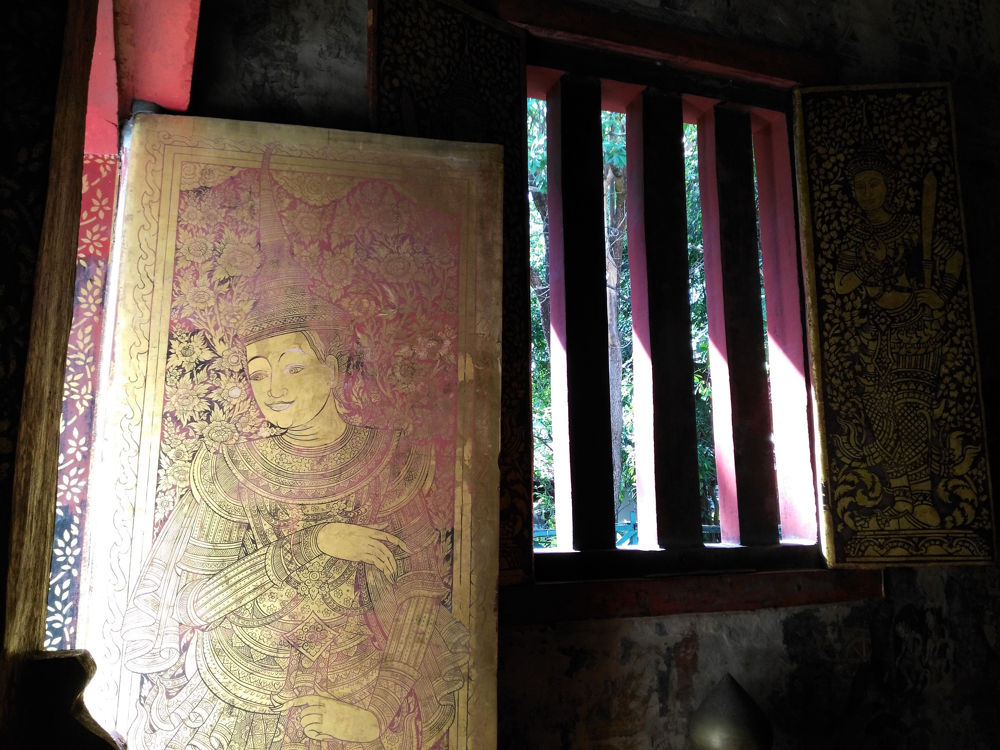
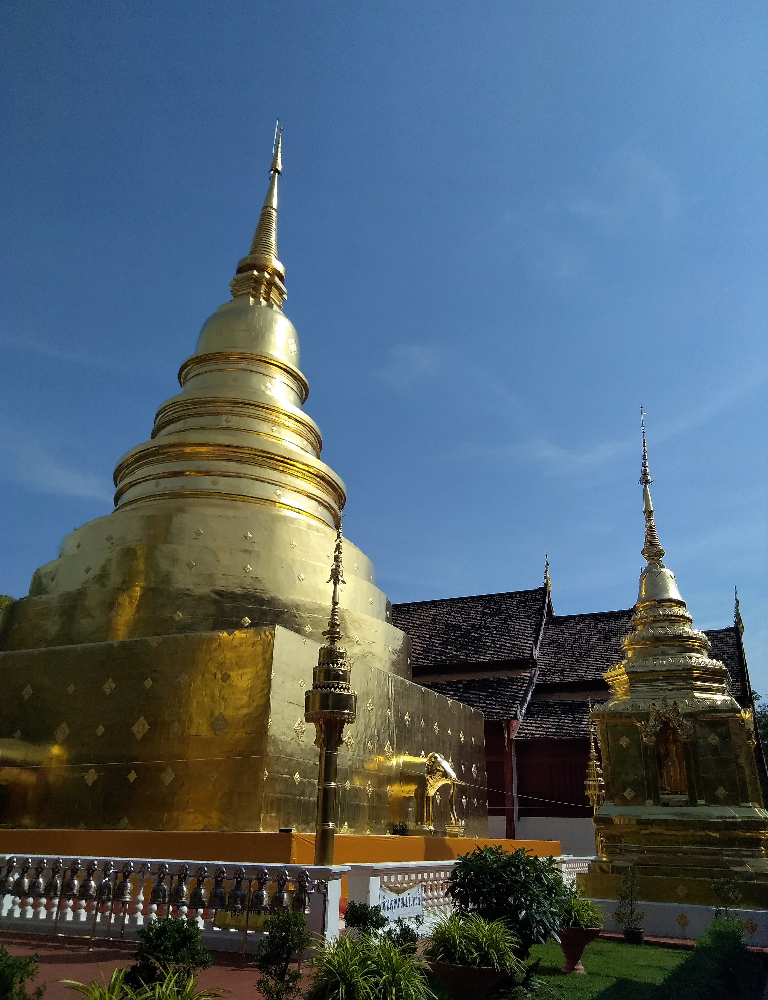
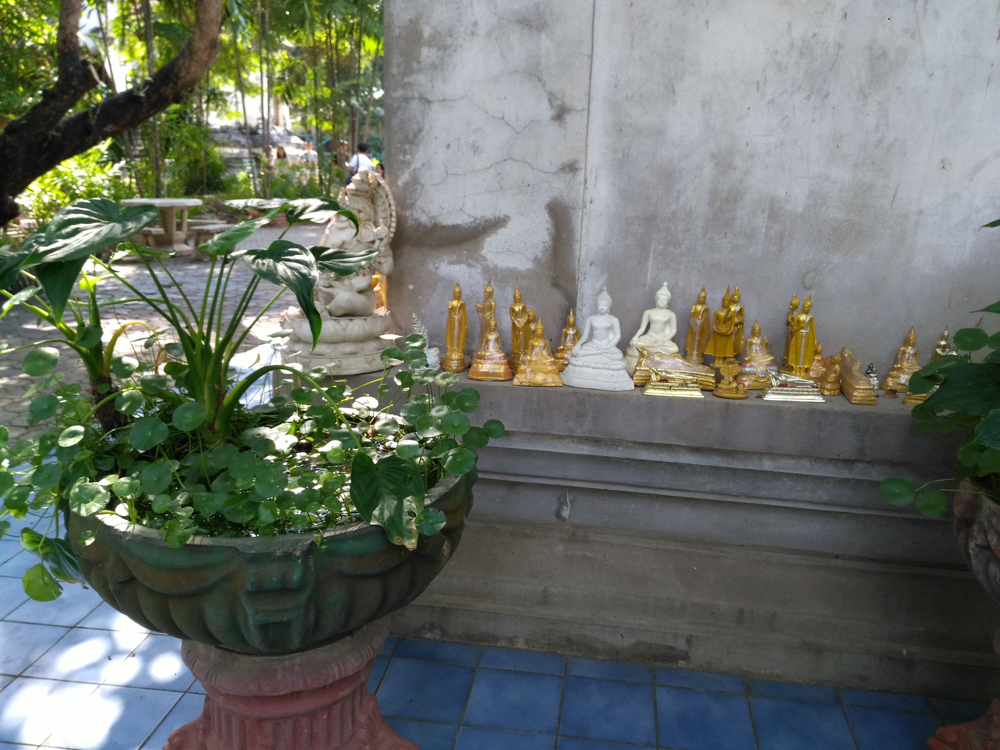
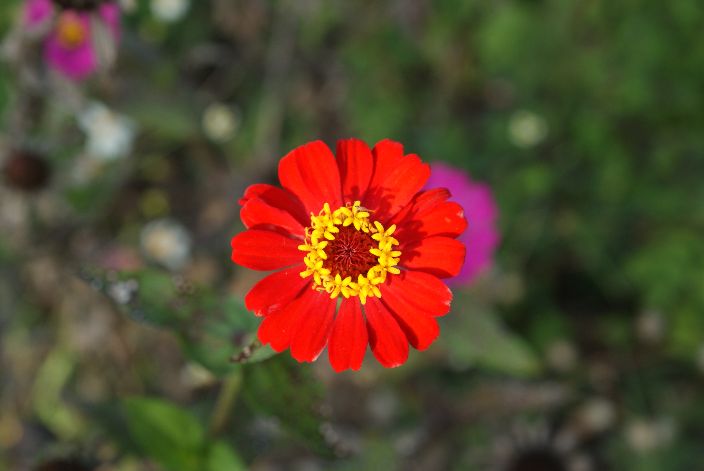

Title: Chiang Mai
Date: 2019-01-28 20:40
Category: Asie du Sud-Est
Slug: ChiangMai
Status: published
SubTitle: une ville prisée aux alentours prometteurs
Cover: images/ChiangMai/ChiangMai_18.jpg
Thumbnail: images/ChiangMai/ChiangMai_03.jpg

# Chiang Mai la très conseillée
Un peu de partout, sur internet ou par les locaux, Chiang Mai nous a été conseillée. Mais déjà on sentait que c'était effectivement très prisé des touristes.  
Et bien sûr, Chiang Mai étant beaucoup plus petite que Bangkok, on sent très vite cette ambiance de ville à touriste (un peu à la manière d'Hoï An ou de Luang Prabang). Mais cela ne veut pas dire qu'il n'y a rien de bon à voir dans le coin.  

Mais commençons par le début. Nous décidons de nous loger pour pas cher au sud de la ville, un peu à l'écart de la vieille ville. Ca nous fera un peu marcher pour les visites, ce qui est bon pour la santé ;). Et aussi potentiellement dans un lieu proposant des treks dans le parc national du coin, qu'on envisage de faire. Mais qu'on ne fera pas finalement. Les offres (de façon générale dans Chiang Mai) nous paraissant un peu chères et les activités... disons que bon le rafting sur des bambous ou le nettoyage d'éléphant, c'est fun, mais c'est quand même bien une activité pour touristes, peut-être au détriment des animaux. Bref, devant ces doutes, on décide de passer notre tour.
Alors qu'avons nous fait à Chiang Mai ?  
Des temples. Des temples, des temples, des temples. Il y a pleiiiiiin de teeeeeemples.  
Sinon la ville possède un zoo (pas fait), et un temple sur la montagne surplombant la ville. Sinon on a fait des temples.  
Et des cafés. Il y a plein de cafés. Vous savez ces cafés à la mode "third place" américaine. C'est sympa un moment, une ou deux fois, mais bon, pas très authentique. Du coup on a fait des temples.  
Et des marchés. Il y a plein de marchés. Des marchés de jours en semaine, de nuit en semaine, de jour en week-end ou de nuit en week-end. Donc des marchés, avec plein de gens, de la street food et des spectacles de rues. Et des marchés dans des temples (oui !). Du coup on a fait des temples.  
On a aussi essayé d'aller au cinéma. Mais par deux fois nous nous sommes gauffrés. Donc bon, on s'est rabattus sur des temples... je plaisante !  

Pendant ce temps là, on se renseigne pour un aller passer 1 ou 2 semaines dans une "ferme" pour aider à construire des maisons en argile. Ils ne peuvent nous acceuillir que dans quelques jours, tout juste le temps pour nous d'enfiler encore une fois notre fidèle destrier et de nous lancer dans une nouvelle boucle en scooter.

# La "boucle" de Samoeng
Nous voilà partis dans une boucle dénichée par Maïlys qui nous emmène dans les alentours de Chiang Mai, en nous faisant contourner la montagne du Doi Pui, passer au travers de villages Mmong et revenir à la ville.  
Mais ne faisant qu'une centaine de kilomètres, il y a à peine de quoi nous occuper jusqu'à notre prochaine destination. On décide donc de monter au sommet de la montagne bordant la ville le premier jour. Il parait qu'il y a de jolis points de vue. Et c'est bien vrai, malgré une route chaotique (petit goût de Laos) et des thaïlandais à la conduite incertaine, ça vaut vraiment le détour. On a une vue sur l'autre vallée, et de belles ballades sur de belles routes dans de belles forêts.
A la fin de la journée, proche de Mae Rim, on se déniche une petite place dans un bungalow en bambous, chez des bouddhistes. On passe une bonne soirée, (Maïlys me parle encore du plat cuisinée par la dame), et le charmant couple ibérico-thaïlandais nous invite le lendemain à les suivre au temple.

On hésite pas, on accepte, et nous voilà le lendemain en train de donner des offrandes (de la bouffe quoi) aux moines après une séance de questions-réponses en Thaï, en tailleur. Et malheureusement on ne comprend pas grand chose, même si le moine nous invite à poser nos questions.  
C'est surtout après, pendant le déjeuner avec les fidèles, que l'on pourra interroger Juan, notre hôte, espagnol de son état, sur ce qui s'est dit, sur le bouddhisme, etc. C'est là qu'on apprend qu'il a été moine un an et demi à Bangkok. Donc oui, il connait plutôt bien son affaire. Bref bon filing, et très bonne expérience, très intimiste dans ce petit temple de 3 moines et 2 moinesses. On repartira même avec le tome 1 de la parole de Bouddha. Cadeau du moine-chef himself.  
On poursuit notre périple à travers la montagne et les villages Hmong, une ballade dans le parc national, des jolis paysages, et un finish où on atterrit par hasard dans un hôtel-village de maison en argile, géré par "Alex", un artiste. Les maisons ont toutes un style différent, très bien décorées, très "cosy". Et partout dans ce lieu, il y a quelque chose à voir, une sculpture, une déco sympa, marrante, originale. Alex étant adepte du junkart (certains l'appellent upcycling) qui consiste à recycler des objets en fin de vie pour de la déco ou de l'art. En tout cas l'endroit vaut le coup d'oeil, et Maïlys nous négocie de main de maître une jolie chambre pour un prix raisonnable.  
Dernier petit resto/bouiboui au village du coin, et nous voilà reparti le lendemain pour Chiang Mai, non sans une séance photo dirigée par Alex (avec nous en stars, bien entendu !).

Je vous passe les détails du comment, notre prochaine étape étant chez Pui pour construire des maisons en argiles (et bien se poser !).

    
    
    
    
    
    
    
    
    
    
    
    
    
    
    
    
    
    
    
    
    
    
    
<\div>

