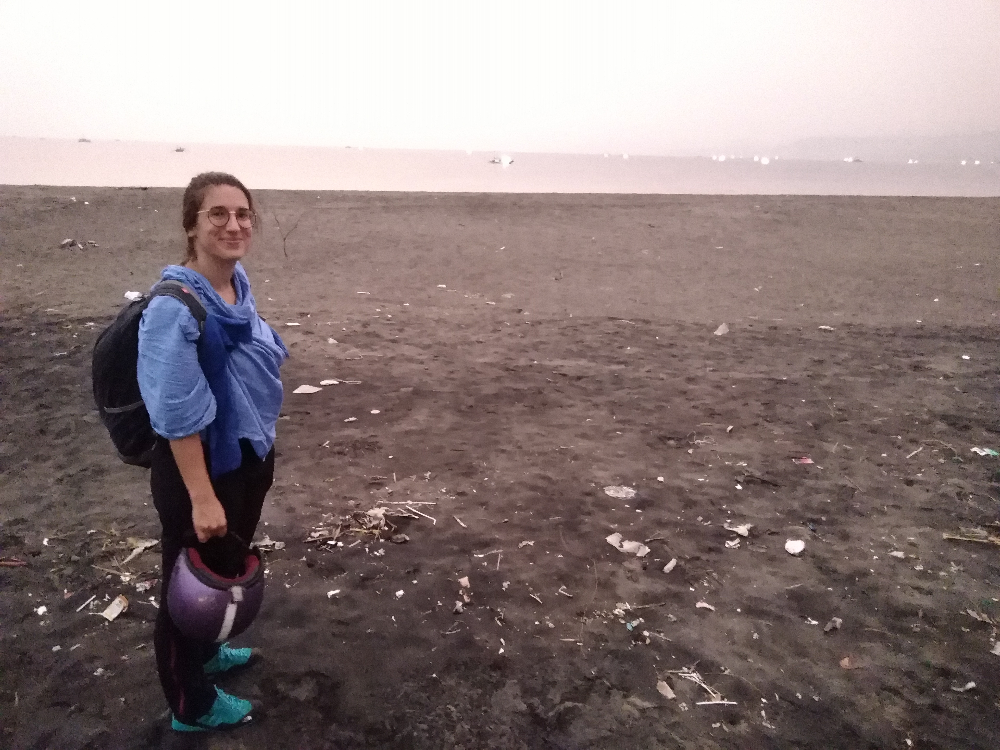
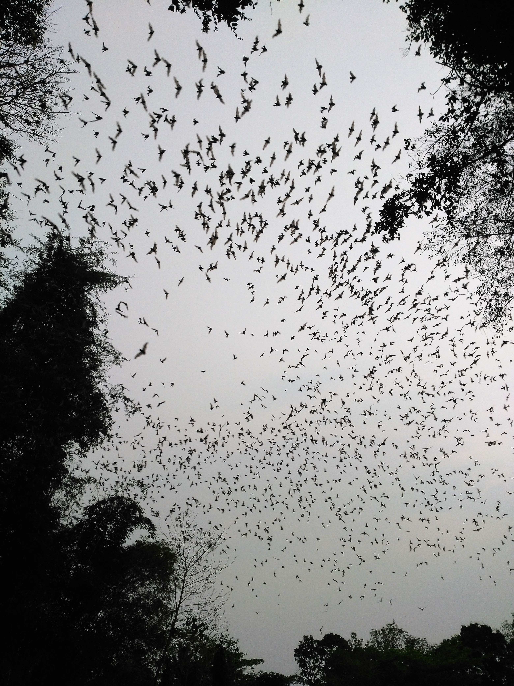

Title: Cimaja
Date: 2018-09-15 10:40
Category: Asie du Sud-Est
Slug: Cimaja
Status: published
SubTitle: Un repos qui se fait désirer 
Cover: images/Cimaja/Cimaja_1.jpg
Thumbnail: images/Cimaja/Cimaja_6.jpg

Nous voilà donc partis. Décollage prévu à 8h55 aéroport Roissy-Charles de Gaulle. 
15h de vol, 2h d'escale à Doha, 3 repas en barquette, 6 films vus dont le choc des titans (j'avais vraiment touché le fond) et vraiment pas moyen de trouver le sommeil... Je pense brièvement à ouvrir le guide, histoire de préparer la suite. Mais non. Être à l'arrache, ce n'est pas qu'un état d'esprit, c'est mode de vie qui se travaille à chaque instant. 

C'est donc ultrafrais que nous arrivons à Jakarta, pour aussitôt reprendre un bus climatisé pendant 2h (trop facile), 6h de bus non climatisé (moins facile), et une mini camionette après avoir traversé un marché abrité par des bâches, sous la pluie of course. Ouf on est arrivés !

Notre hôtel, à Cimaja, très chouette est composé de plusieurs sortes de chalets, calés en bord de rizières.
Après du repos bien mérité, nous décidons d'abord d'aller tranquillement à pied à la plage. Il y a une ambiance toute particulière, avec le temps un peu brumeux, quelques surfeurs mais globalement pas grand monde. La ballade est appréciée. 

Le lendemain on est des fifous, on loue un scooter. Rien que ça, c'est une aventure. Il y a une grosse différence entre être la passagère peu coopérative d'une driveuse chevronnée pour aller au taff à Toulouse et ... tenter de survivre sur un deux roues en Indonésie.
Conduite à gauche, treize personnes qui te doublent à la seconde de tous les côtés, et des routes en mode space moutain. Mais tellement sympa de découvrir du pays comme ça.

Nous partons donc en direction des "hot water springs", des sources d'eau chaude dûes à l'activité volcanique. Au programme, petits geysers et randonnée à destination d'une cascade que nous n'avons jamais trouvée. On a traversé des petits villages colorés avec des gens toujours très souriants et décidés à t'aider (même s'ils n'ont pas du tout compris ce qu'il te fallait), bref une population des plus accueillantes.

Direction ensuite Goa Lalay, une grotte avec des milliers et milliers de chauves-souris, qui vers 17h sortent en rangs serrés de la grotte pour aller à la chasse. Ça fouette, tellement que ça pique les yeux. Le spectacle est bien au rendez-vous quand l'essaim sans fin de chauves souris commence à sortir de sa grotte. Le gars qui nous a ouvert la grille nous demande si nous avons réussi à voir les pythons qui étaient dans la grotte. Merci d'avoir gardé cette info pour la fin monsieur.

Départ pour Yogyakarta, j'ai hâte.

Maïlys

	
	
	
    
    
    
    
    
    
    
    
<\div>
