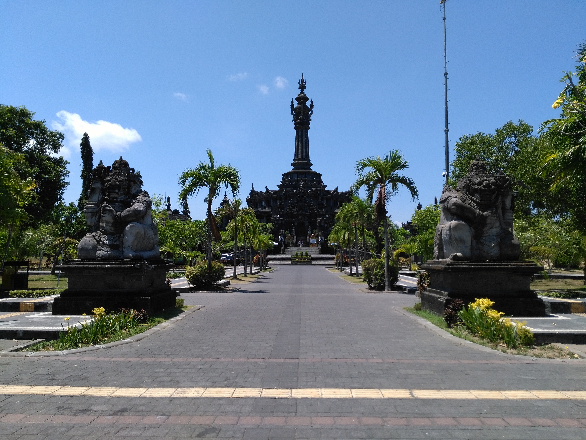
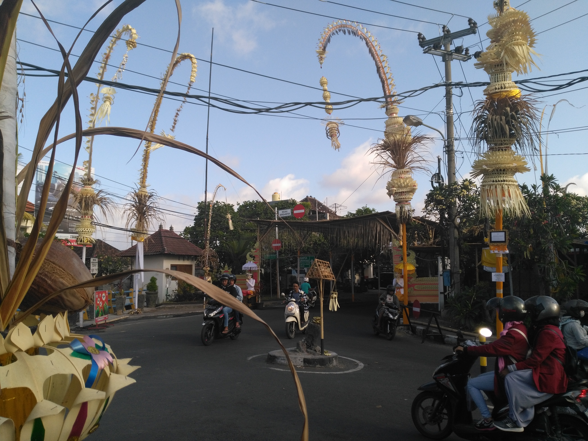
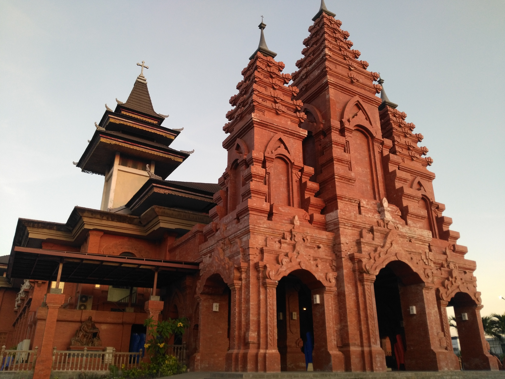
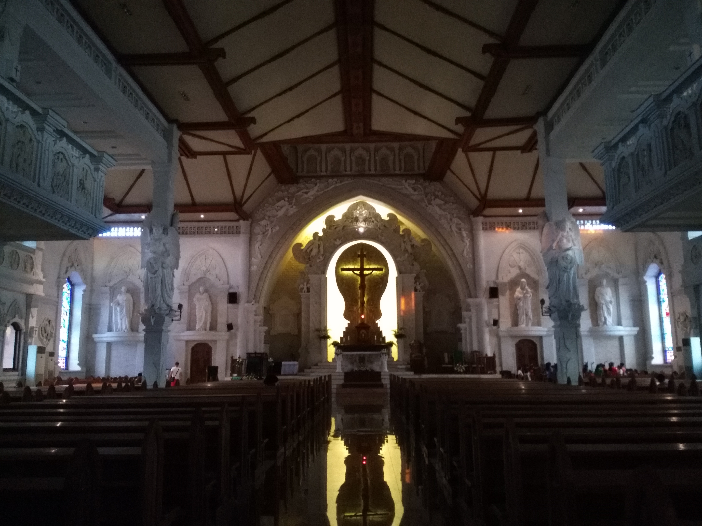
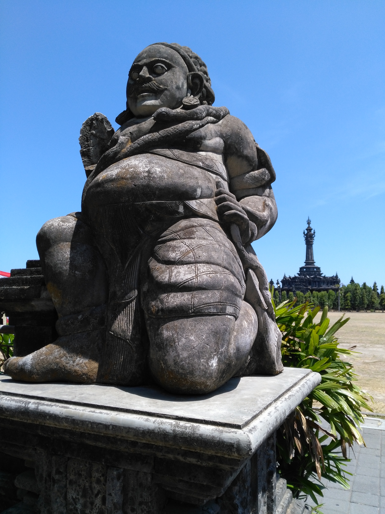
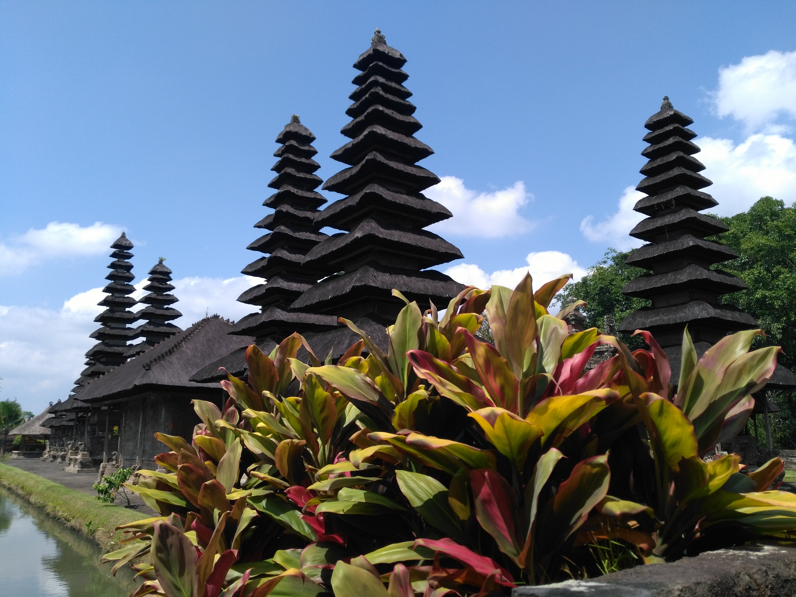

Title: Denpasar
Date: 2018-10-15 10:40
Category: Asie du Sud-Est
Slug: Denpasar
Status: published
SubTitle: on dirait le suuuud
Cover: images/Denpasar/Denpasar_02.jpg
Thumbnail: images/Denpasar/Denpasar_04.jpg

# Denpasar
On a un peu foiré notre coup avec les billets pour aller au Vietnam. On avait pensé à aller à Sulawesi (sur ce coup on a eu chaud) et à aller à Flores (trop cher). Pas possible d'aller à Lombok ou aux Gili pour se promener tranks pendant que les gens reconstruisent leurs maisons. Donc on a fini par estimer notre date de départ de Bali au 25. Il nous fallait donc rallonger notre visa ... pour 5 jours.

Le problème qu'on avait pas anticipé, c'était la difficulté pour avoir cette extension. Trois rendez vous à plusieurs jours d'intervalle, passeport gardé par l'immigration, empreintes et photos sur fond rouge, bref la totale. Après moultes tergiversations, on se décide donc à aller à Denpasar. A 7h45 du mat', on est dans les locaux, prêts à y camper toute la journée. Résultat, à 8h55 on en été sortis. 
La grosse question se pose alors : que faire à Denpasar ? Le lonely n'est pas foufou de détails sur cette ville et dans les blogs, on nous parle du muséum et d'un marché qui a surement brûlé. Great !
Un petit mot sur l'ambiance de la ville. Ce n'est pas la grosse mégalopole asiatique comme on se l'imagine. Il y a des gros axes où tu peux rester une demi-heure au bord de la route à jouer ta vie pour traverser. Sylvain finit généralement par régler la situation en forçant le passage, et ça marche plutôt pas mal. Le deuxième problème de ces grosses routes qui voient quand même passer une belle majorité de scooters c'est cette espèce de bourdonnement incessant. Bon et la bonne odeur des pots d'échappement. Mais entre ces grands axes il y a plein de petits quartiers, petites rues (pas du tout répertoriées dans Maps), petites maisons avec de la vie qui déborde dans tous les sens. On a été très surpris par toute cette verdure, c'est une ville avec une quantité de plantes et d'arbres très sympa. Et puis comme partout ailleurs il y a plein de poules, oiseaux, chiens et chats. Bref il y pas mal d'endroits où se croit à la campagne et pas dans le chef lieu de Bali.

Le museum de Denpasar était sympa également, très beaux bâtiments surtout. Notre guide (ou plutôt le mec qui s'est précipité sans nous demander pour faire office de guide) nous a plus appris de choses sur la vie des balinais que sur le musée lui même. Il y a des fêtes et des cérémonies tout le temps, ce qui explique pourquoi ils vont mettre si longtemps à nous faire le visa. Quand ce ne sont pas des jours de fêtes officiels, il y a aussi les cérémonies qui concernent la famille, les amis ou les voisins. Les balinais invitent notamment beaucoup de monde pour le jour où ils déposent pour la première fois leur enfant sur le sol. 

# Canggu
Le lendemain direction Canggu, où on se fait refouler de l'hôtel qu'on avait réservé (une hutte en bambou, merde !!), et grosse galère pour trouver un scooter. Et pour cause, Canggu et les alentours grouillent de touristes, dont beaucoup d'Australiens. Pas le temps de s'y attarder, en selle et on file retrouver Mélanie et Alex pour se faire un petit repas avant qu'ils repartent. L'après midi direction le Tanah Lot, un temple emblématique de Bali. On s'attendait à visiter un lieu de culte et à faire une donation tranquille, comme c'est l'usage ici. Que nenni ! C'est un grand péage qui nous attend, suivi de trois parkings, et des rues entièrement remplies de magasins de souvenirs, de fringues et de restos, c'est DI-SNEY-LAND. Arrivés sur place on tombe sur des foules de touristes qui se pressent dans tous les sens pour avoir le meilleur selfie coucher de soleil. C'est a peu près tout ce que j'ai retenu de cet endroit.

Le lendemain on se décide à partir à Mengwi pour aller retenter notre chance au pays des temples avec le Taman Ayun. Très belle surprise cette fois-ci, avec un très beau temple classé au patromoine de l'Unesco, plusieurs bâtiments et jardins bien entretenus et pas submergés par les touristes. Petite randoscoot a travers les villages et rizières bien cool, et déja il est temps de repartir pour Denpasar pour le second rendez vous. 

Bientôt Sidemen et Nusa Penida, j'ai hâte !
MaïMaï

    
    
    
    
    
    
    
    
<\div>
