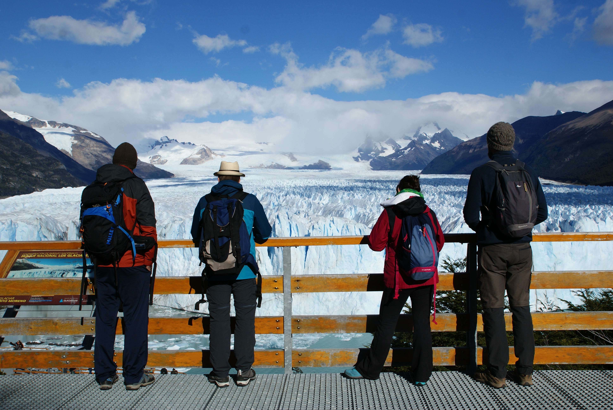
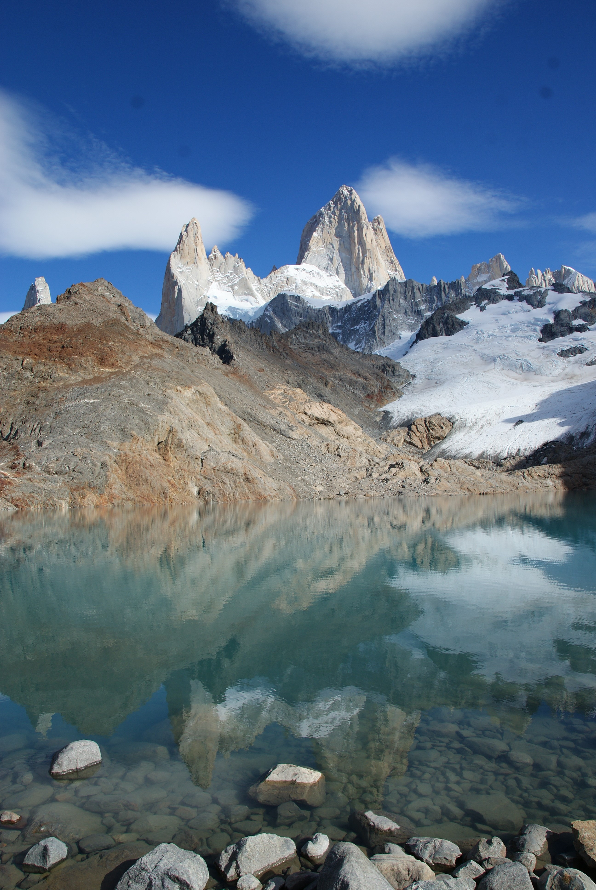

Title: El Calafate et El Chalten
Date: 2019-03-20 20:40
Category: Amerique du sud
Slug: Calafate
Status: published
SubTitle: Le Perito Moreno et le Fitz Roy
Cover: images/ElCalafateElChalten/ElCalafateElChalten_04.jpg
Thumbnail: images/ElCalafateElChalten/ElCalafateElChalten_17.jpg

# El Calafate et son Perito Moreno

De retour à El Calafate pour retrouver nos compagnons de route pour les 3 prochaines semaines. Merci donc à Caroline, Christophe, Johann et Julien d'avoir bien voulu passer leurs vacances avec nous.  
Je les récupère donc à leur hôtel, et c'est parti pour une petite balade au bord du lac et ses flamands roses. Toujours d'incroyables couleurs, la lumière patagoniène a quelque chose d'incroyable qui rend chaque paysage digne des plus beaux tableaux impressionistes. Nous poursuivons la visite de la ville, qui elle n'a rien d'exceptionnelle. Mais bon il faut bien tuer le temps en attendant la virée de demain au glacier du coin (et je parle pas de de crème glacée). C'est surtout le moment pour se raconter toutes nos petites histoires autour d'une bière, nous n'avons pas vu tout le monde lors de notre passage à Paris. Et les joyeusetés se poursuivent jusqu'à dans la soirée.

Le lendemain, nous avons un programme chargé. Visite du Perito Moreno, et retour à la station de bus de la ville à 16h pour s'en aller à El Chalten.  
Et là les mots vont commencer à me manquer pour décrire le grandiose de ce qu'on a vu. Je resterai donc factuel. Nous avions réservé une expédition avec 2 taxis pour être sûr de tenir le délai. Caro, Maïlys et moi tombont sur Sergio, tout simplement le chauffeur de taxi le plus gentil et sympa du monde. Point barre. Le trajet nous est donc très agréable et les filles arrivent à papoter avec lui. Malheureusement de mon côté, mon espagnol est très lacunaire, je ne capte généralement que des bouts de conversation. Bref, une fois arrivés dans le parc, on s'arrête à quelques points de vue, et déjà le glacier apparaît impressionnant. Nous continuons jusqu'aux plateformes en face du glacier qui permettent d'en apprécier une bonne partie avec explications à l'appui. Et d'ailleurs les chiffres, que je n'ai plus en tête, sont impressionnants. La vitesse d'avancée de la glace, sa taille, les températures…bref c'est un sacré monsieur ce Perito Moreno !  
On se paye même le luxe d'une petite expédition en bâteau au plus près de la glace. Les couleurs de la glace et de l'eau sont merveilleuses, et le spectacle est rythmé par le bruit des blocs de glace qui se détachent régulièrement du glacier. Juste, «wouhahou !!!».  
On retourne ensuite à la ville en profitant des incroyables paysages de la route, et comme on a un peu de marge, Sergio nous offre un petit tour de la ville avec points de vues extraordinaires sur la nature environnante et anecdotes sympas. Une fin très sympathique que malheureusement n'auront pas nos 3 autres comparses, leur chauffeur étant de nature plus pressé.

On fini par prendre le bus direction El Chalten. Et la route pour y arriver offre déjà une vue sur le Fitz Roy pas dégueu. Qui se montre à nous entouré de nuages noires, avec cette lumière que seule la Patagonie sait faire, ce qui rend le spectacle assez saisissant et un peu funeste. Il faut rester humble ici, la nature a ses arguments pour nous mater.

# El Chalten et son Fitz Roy

On se paye à El Chalten un petit chalet pour nous 6 plutôt sympa, et après un petit resto de viandard, on se couche déjà. Le lendemain on se décarcasse avec une petite balade de 4-5h pour aller voir 3 aiguilles rocheuses surplomblant un lac de montagne alimenté par un glacier (c'est-à-dire qu'il y avait littéralement des glaçons dans l'eau, parfait pour les amateurs de pastis). C'est aussi l'occasion de se rendre compte que les alentours d'El Chalten sont vraiment très jolis.

Le lendemain on se décide pour un lever de (très) bonne heure histoire d'aller admirer un lever de soleil sur le Fitz Roy, sur les conseils de Christophe. Hé bien ça valait tous nos efforts (et pourtant on se les ai caillés sapristi), car encore une fois la Patagonie nous a gratifié d'une lumière merveilleuse révélant des couleurs incroyables sur notre cher Fitz Roy. Imaginez-le drapé de rose et se découpant sur un bleu turquoise, accompagné de nuages cotonneux en mode barbe-à-papa. Les photos ne rendront jamais justice à ce spectacle. La balade se poursuit jusqu'à un lac faisant un miroir parfait au pied de notre ami Fitz, là encore le spectacle vaut tous nos efforts (et avec un finish assez physique, c'est pas peu dire !). Et grande fierté, chacun de nous 6 est arrivé jusqu'au sommet. C'était pas gagné avec la bande d'écloppés que nous sommes.  
Bref on rentre ereintés mais heureux d'avoir pu voir cette nature incroyables avec un temps qui décidément nous a à la bonne.

Le lendemain il est temps de nous quitter déjà une première fois. Nos 4 comparses rentrent à El Calafate pour prendre un vol jusqu'à Buenos Aires. De notre côté, pour des questions de budget, on pousse jusqu'à Rio Galegos pour prendre un avion pour la capitale le jour suivant.

See you Patagonie ! Tu as été à la hauteur de nos espérances, et merci de ta météo clémente lors de notre visite, on sait que c'est un cadeau précieux avec toi.

    
    
    
    
    
    
    
    
    
    
    
    
    
    
    
    
    
    
    
    
<\div>

