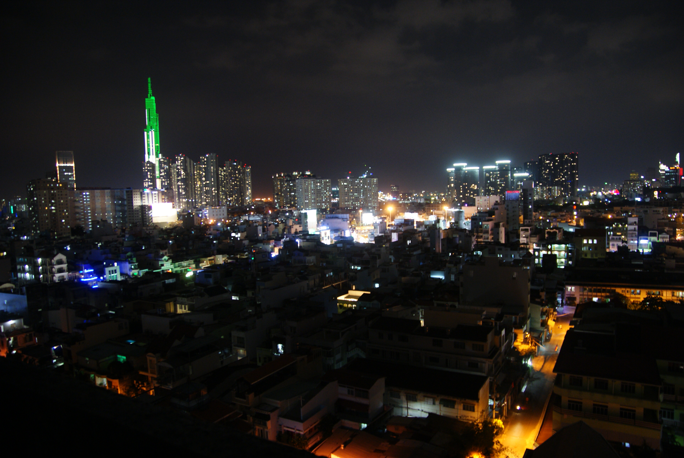
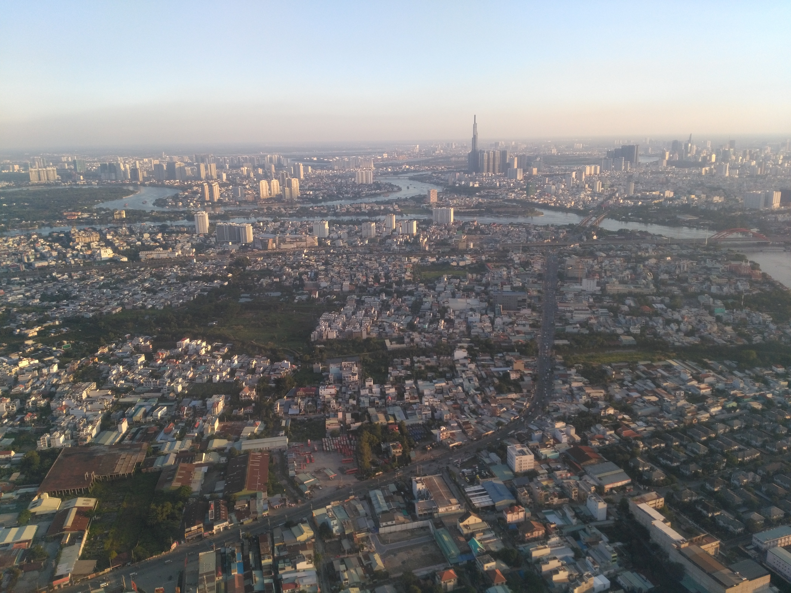
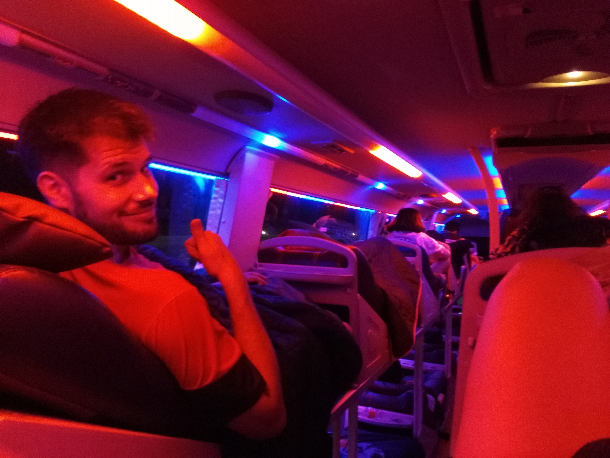

Title: Ho Chi Minh City et Dalat
Date: 2018-11-05 10:40
Category: Asie du Sud-Est
Slug: HoChiMinh
Status: published
SubTitle: La maladie ne nous arrêtera pas !
Cover: images/HoChiMinh/HoChiMinh_01.jpg
Thumbnail: images/HoChiMinh/Dalat_14.jpg

# Ho Chi Minh ville
Nous voici arrivant à Ho Chi Minh ville (Saigon pour les moins au fait, mais rassurez les vietnamiens eux-mêmes utilisent les 2 noms indifféremment). On se doutait un peu de ce que l'on allait trouver, Ho Chi Minh ville étant la ville la plus peuplée du Vietnam, mais toujours est-il que pour nous c'est un changement radical d'ambiance. On passe d'Amed, où la vie prend son temps, à cette mégalopole grouillante et fourmillante. Changement de pays et changement d'univers ! Et comme nous commencions un peu à en avoir marre de rester dans les lieux pour touristes, je nous avais choisi un appart' qui semblait vraiment être chez l'habitant (et pour des raisons économiques aussi, bien entendu). Histoire de rencontrer du local. Et sur ce dernier point, c'est réussi !

En effet nous atterissons dans une sorte de colloc' vitenamienne un peu à l'écart du centre-ville, avec une partie dortoir et des chambres. On a jamais compris vraiment comment ça s'organisait, étant donné qu'il nous semblait qu'il n'y avait pas assez de lits/chambres pour accueillir tout ce beau monde. Mais nos collocataires d'un moment se révélèrent de sympathiques compagnons, et nous avons bien échangés avec eux.
Et nous avons vu un peu d'Ho Chi Minh ville aussi, du coup. Surtout le premier jour, où nous sommes allés dans l'ancien quartier colonial et décidé de  visiter le musée de la guerre. Autant dire que pour ce dernier, il faut avoir le coeur bien accroché. Tout en étant bien conscients que ce serait une exposition pluôt subjective et partisane des faits, cela n'empêche pas qu'ils ont eu lieux. Et comme le dit si bien l'autre : "c'était pas ma guerre !". Qu'est-ce qu'ils ont morflés les vietnamiens tout de même, c'est triste à voir. Juste pour n'être pas à la bonne place (ou plutôt une trop bonne place, trop stratégique pour être laissée au calme...). Le soir on aura le droit à une petite virée culinaire avec les deux filles qui "gèrent" la colloc. L'occasion d'essayer quelques curiosités du pays, comme les oeufs avec un foetus bouilli. Sorte de canards pas nés (après le poisson). C'est dégueu à voir et à imaginer, mais pas si dégueu dans la bouche. On finit par un karaoké sur le rooftop de notre immeuble, avec une vue magnifique et où l'on rencontre d'autres locataires dont un acteur/clown/saltimbanque qui a le goût de la mise en scène. Excellent pour nous, on se sent vraiment immergés dans ce nouveau pays.

Mais le lendemain c'est la douche froide. Maïlys se réveille avec une fièvre carabinée. Elle n'est que l'ombre d'elle-même, terrible...On reste donc 2 jours tranquilles, sans visite, pour qu'elle prenne un peu de repos. Et on a le droit à de gentilles attentions de nos collocs qui nous prodiguent conseils et médécine traditionnelle pour venir à bout de cette fichue maladie. J'en profite pour aller me faire faire une beauté (comprendre enlever la tignasse et de la barbe), et je fait le bonheur d'un jeune salon de coiffure pour lequel je suis le premier étranger. Et je crois que jamais on n'a autant pris soin de mes cheveux.
La maladie (presque) passée, nous décidons de poursuivre notre voyage et de partir pour Dalat qui nous a été recommendé de nombreuses fois.

# Dalat
Avant Dalat, il y a le bus de nuit pour Dalat. On ne sait pas encore à quoi s'attendre même si on nous a dit que c'était confortable. C'est en vérité assez étonnant, ce sont comme des chaises longues sur deux étages (un peu trop courtes pour moi mais bon, je ne suis pas dans les standards du pays). On peut donc assez facilement dormir je pense, même si ce ne fut pas vraiment mon cas (le voyage était de toute façon assez court).

Dalat est donc une ville d'apparence assez occidentalisée, très touristique (même si nous sommes un peu hors saison). C'est un lieu de repos et de détente pour les vietnamiens, surtout venus d'Ho Chi Minh city pour échapper un peu à la ville. Il y a quelques attractions, et des hôtels luxueux, mais Dalat est surtout prisé pour ses alentours montagneux et son air frais. C'est vrai qu'ici on est loin de l'étouffante chaleur d'Ho Chi Minh ville, il fait presque froid le soir. Et même si on ne prendra malheureusement pas le temps de trop sortir aux alentours, c'est l'occasion pour nous de quelques bonnes ballades. C'est bon de marcher après ces jours de ralentissement. On visite également un monastère bouddhiste vraiment fabuleux, cf. les photos.

C'est en nous baladant dans la ville que nous faisons la rencontre d'Hoan, un "easy rider" qui va nous faire changer nos plans pour la semaine à venir.

    
    
    
    
    
    
    
    
    
    
    
    
    
    
    
    
    
    
    
    
<\div>
