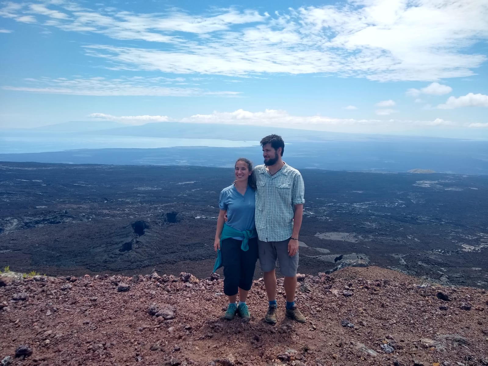

Title: Isla Isabela
Date: 2019-07-20 08:04
Category: Amerique du sud
Slug: Isabela
Status: published
SubTitle: L'île nature
Cover: images/IslaIsabela/IslaIsabela_28.jpg
Thumbnail: images/IslaIsabela/IslaIsabela_18.jpg

Pour dix jours d'aller retour sur les Galapagos, et un budget pas si extensible, nous avons dû faire des choix en terme d'îles, et notre seconde et dernière étape est Isabela. C'est la plus grande de l'archipel, mais aussi la moins peuplée. Nous partons donc vers cette contrée encore plus nature...

# Du bateau : des potos

Pour aller à Isabela depuis San Cristobal, il y a deux choix : prendre un petit avion direct, ou prendre deux bateaux, en faisant obligatoirement une étape. On se lève donc assez tôt, on attrape le premier bateau, et on arrive sur Santa Cruz, l'île au milieu de San Cristobal et Isabela. La ville portuaire est en effet plus touristique qu'à San Cristobal, et ça se sent jusque dans l'attitude des rabatteurs de restos. On se pose dans un petit café, bien décidés à avancer toutes les tâches qu'on a en attente (blog, comptes, plannif en tout genre...). Ici le petit déj ce sont des boules frites fourrées à la viande et/ou aux légumes. Miam !

Puis second bateau, on se retrouve en tout petit comité. Mais ce petit comité nous aura collé à la peau, on ne se quittera plus d'Isabela. J'ai nommé :
- Melissa (Chilienne, mais habitait en Suisse depuis 15 ans avant son voyage long cours)
- Miri (Californienne, pas américaine hein, faut pas confondre, elle ne veut pas être liée avec Trump)
- Haness (du nord de l'Italie, en voyage jusqu'à plus d'argent)

On se ballade ensemble à Isabela, et nous finirons dans leur hostal après une nuit dans le notre. Le soir, on se retrouve pour un repas du soir mijoté par les soins d'Haness qui avait le bon goût d'être cuisinier de profession. C'est fini ce temps-là pour lui, sauf quand il s'agit de faire plaisir à une tribu d'affamés.

# Premier jour, première aventure : Sierra Negra

Dès le premier soir, on s'est mis en quête ensemble d'une agence pour explorer los Tuneles, un des site de snorkeling (masque/tuba), les plus chouettes des environs, mais aussi Sierra Negra, un volcan accessible seulement avec un guide. On était bien déterminé à faire une sérieuse négociation/comparaison de toutes les agences. Mais c'était sans compter qu'on était dimanche soir, et du coup, moins d'agences ouvertes et une négo moins rondement menée que dans nos têtes. C'est l'jeu ma pauvre Lucette !

Le lendemain, une camionette barriolée vient donc nous chercher avec le groupe, et nous rencontrons notre guide dont je ne me souviens plus du prénom. La ballade est facile est sympa, un peu trop peuplée à mon goût, mais très vite, les groupes se dispersent. Et nous arrivons sur le magnifique cratère de environ 11 km de diamètre (entre 8 et 11 selon les endroits puisqu'il n'est pas parfaitement circulaire). C'est impressionnant cet immense trou noir bordé de végétation et qui accroche les nuages par endroit. Malheureusement, ce paysage est très mal rendu en photo. 

Nous continuons donc notre chemin le long du cratère puis partons sur la droite pour descendre sur une scène littéralement lunaire. Tout est de roche noire et rouge, très découpé, et en arrière plan, d'autres volcans et l'océan. Le guide nous montre les différentes roches, et nous sommes toujours surpris par leur poids, léger. 

Le retour se fait tranquillement, on saute le repas et on part se ballader entre filles (satanée migraine de Sylvain). Nous partons en expédition chercher les flamants roses, qui sont paraît-il hyper nombreux dans les maraîcages. On en croise quelques uns, de loin, et malgré toutes les stratégies de Méli, ils ne veulent pas sortir la tête de l'eau les bougres... On passe également par un centre de préservation des tortues terrestres, et ça nous met pas mal en colère. Les tortues ont l'air affamées, et semblent épuisées (et pourtant on est pas des expertes, c'est vous dire combien c'est flagrant). Méli va voir le gardien pour lui demander pourquoi elles sont dans cet état là, et il lui répond qu'ils les ont mis à la diète en lui claquant la porte au nez, ce qui la met encore plus en colère. 

On argumente sur le chemin, et on finit par solutionner le problème en instaurant un rituel : le mojito sur la plage. Le soir petit resto local de poisson, avec des portions éééénormes.

# Deuxième jour : los Tuneles

Pour ce deuxième jour, on reprend le bateau et c'est parti pour los Tuneles.  J'ai énormément de chance car à l'aller je vois une raie manta furtive à côté du bateau. Objectif 1 : check !

C'est un paysage bien différent qui nous attend ensuite. Des bouts de terre, avec des cactus forment un labyrinthe sur l'eau, et des tunnels, d'où le nom du lieu, logique ! Et là, on a l'immense chance de voir des fous à pattes bleues, aussi appelé boobies, ou de leurs vrais noms : Sula nebouxii. Ces oiseaux, qu'on espérait voir depuis San Cristobal sont enfin sous nos yeux ! Et ils ne nous ont pas déçus, ils sont beaux et rigolos à la fois, surtout de face, et pas farouches. Objectif 2 : check !

Ensuite il est temps d'aller dans l'eau, gelée. Luis, notre spécialiste repère les différents animaux et nous guide. On verra énormement de tortues, toujours aussi pépouzes, deux hippocampes accrochés au fond, des poulpes, différentes espèces de raies, une murène. Mais aussi des requins, et Luis nous pousse tour à tour dans une grotte pour voir un petit banc qui font la sieste. Ils sont de bonne taille, et c'est pas toujours rassurant de se retrouver nez à nez avec eux dans une cave sous marine, mais quand même complétement extraordinaire. Ce sont des requins des Galapagos et sont inoffensifs (il parait).

On réussi même à voir des pingouins de loin : objectif 3 : presque check. 

L'après midi, on prend un petit pickup et on se rend au mur des larmes. En effet, avec le lourd passé de torture et d'exploitation des prisonniers des Galapagos, il fallait bien qu'il en reste des vestiges. Ce mur, inutile, a causé la mort de centaines de bagnards. Il a été construit entre 1946 et 1959. On a donc fait une ballade sur les points de vue, puis avons découvert ce mur de 7 mêtres de haut, 3 m de large. En effet, on se rend bien compte du danger de construire à la main cet édifice inutile. Notre ballade et notre journée se finit sur un très beau point de vue. Dernier repas et demain, Haness et Melissa s'en vont...

# Troisième jour : Snorkeling et ballade en vélo

Haness est parti tôt, Mélissa a encore une matinée, nous en profitons pour aller explorer en masque et tuba Concha de Perle. C'est en fait un bout de ponton, d'où tu descends pour arriver direct dans une eau bleue et transparente. 

On en profite bien et Sylvain joue avec les lions de mer et nage avec eux. On voit aussi des requins et un banc de raies. 

L'après midi on est tous les trois et on se loue des vélos. On monte en taxi pick up jusqu'au sommet, pédaler en descente c'est plus rigolo. Sur le chemin on ira explorer la Cueva del Sucre. Une grotte, donc, ça faisait longtemps où on est juste tous les trois à essayer de trouver des passages secrets. Indiana Jones en puissance ! 

On passe aussi par un très beau point de vue sur la jungle : El Mango. Et on se ramasse des fruits sur le chemin. Une après midi parfaite, cheveux dans le vent.

Puis Miri nous quitte aussi, et nous partons faire un dernier tour sur la plage.

# Jour 4 : il est temps de repartir

Le quatrième jour, on prend le bateau à 6h du matin, et ça nous a bien secoué. Sur Santa Cruz, on retrouve Miri et Mélissa et on se fait un petit tour au centre des tortues. Puis ce sont les vrais adieux et on retourne sur San Cristobal. Demain, adieu les Galapagos et re bonjour le continent.

Galapagos on te quitte, promis on reviendra,

Mailys

    
    
    
    
    
    
    
    
    
    
    
    
    
    
    
    
    
    
    
    
    
    
    
    
    
    
    
    
    
    
    
    
    
    
    
    
    
<\div>

