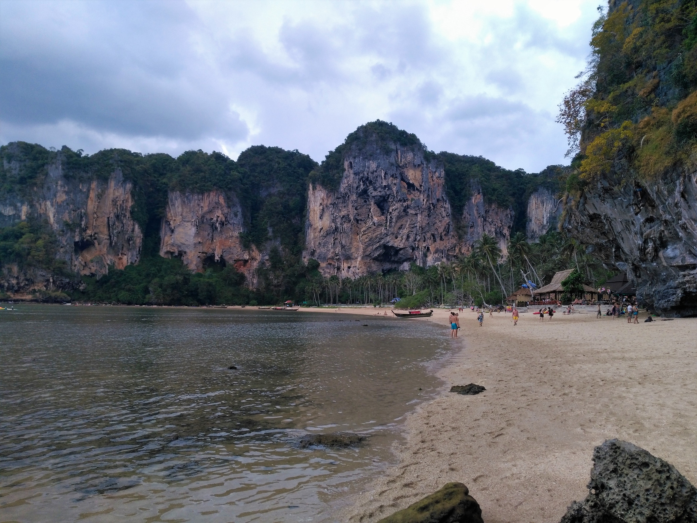
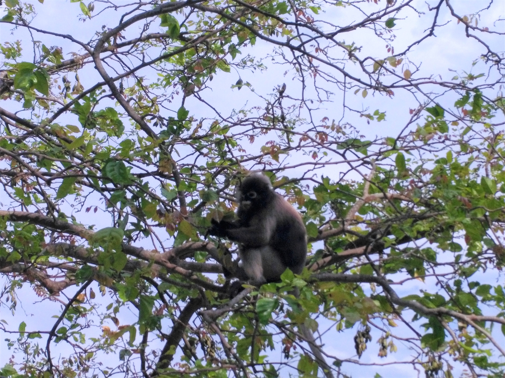
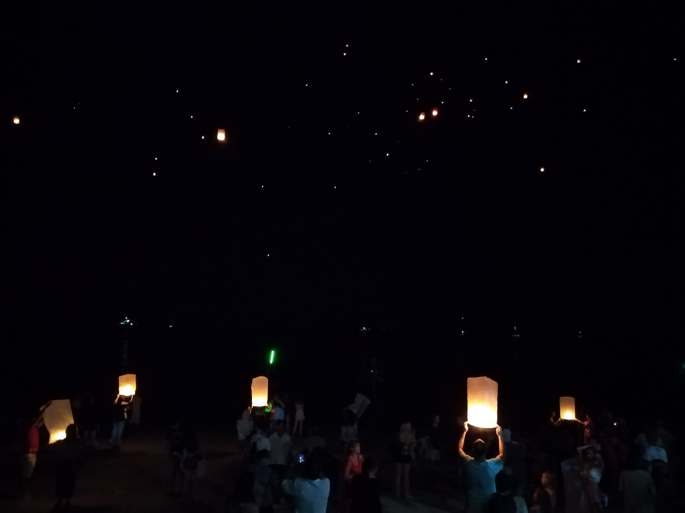
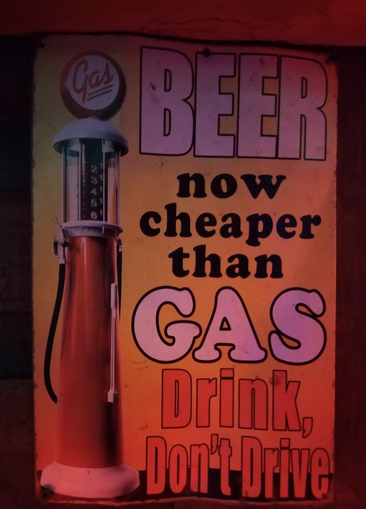
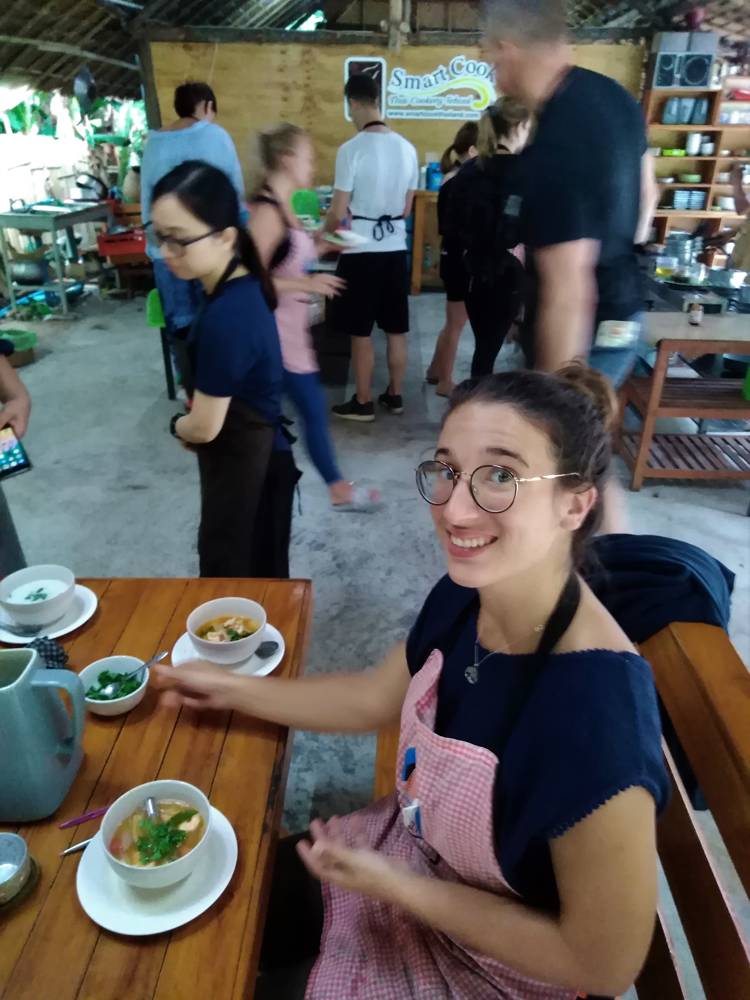
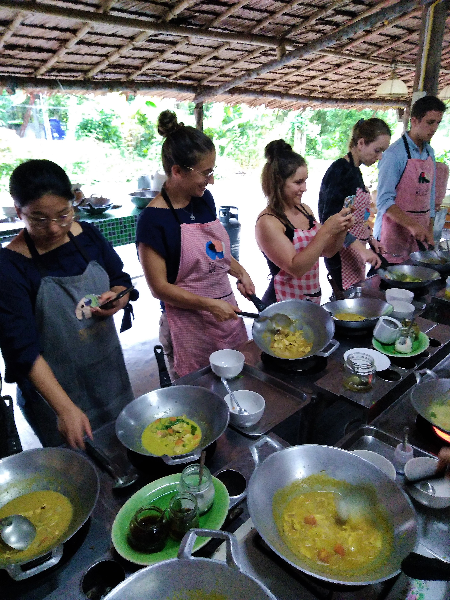
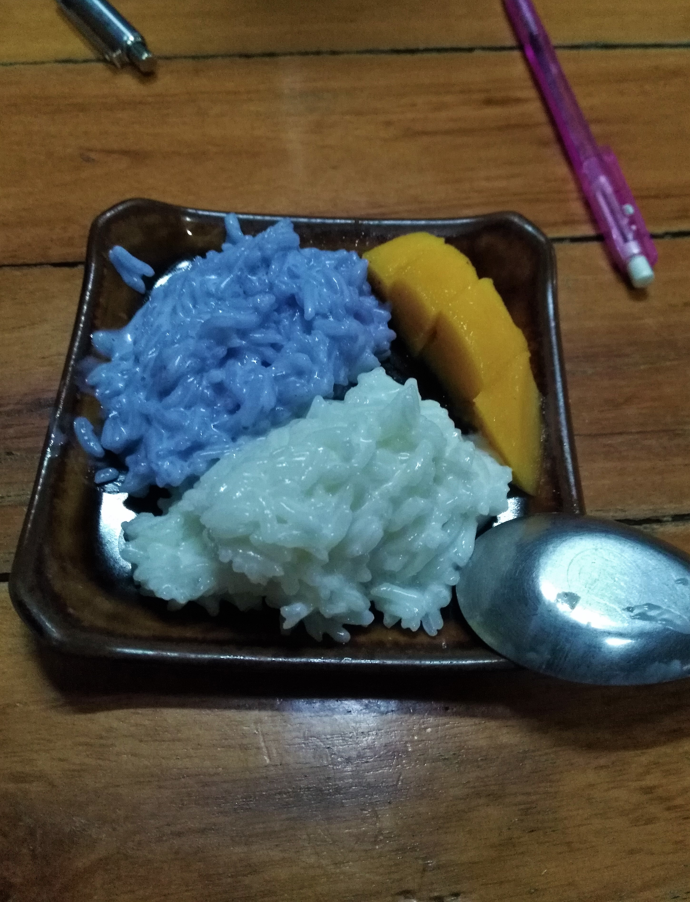
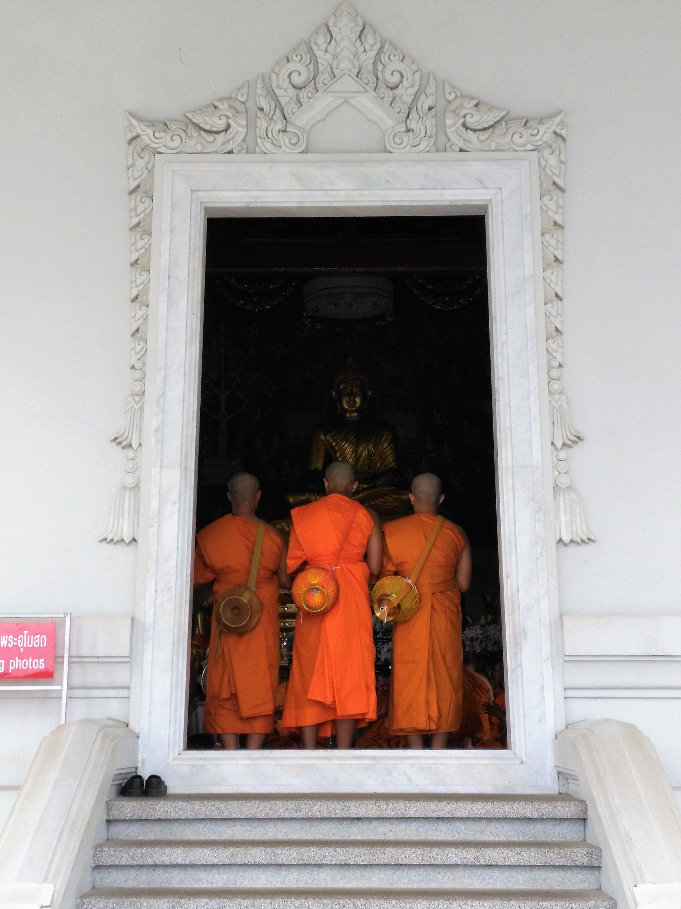

Title: Krabi et Ao Nang
Date: 2019-01-23 20:40
Category: Asie du Sud-Est
Slug: KrabiAN
Status: published
SubTitle: Fiesta et tempête tropicale
Cover: images/Krabi/Krabi_01.jpg
Thumbnail: images/Krabi/Krabi_00.jpg

# Mais que faire ?

Après ces paysages idylliques des îles, nous avons eu un peu de mal à décider du programme pour la suite des vacances avec Aurélie et Rémy. Et que faire pour le jour de l'an ? Nous savions que nous voulions passer notre premier niveau de plongée avec Sylvain, donc nous souhaitions rester dans le sud. Auré et Rémy n'avaient pas de billet et ne savaient même pas s'ils repartaient le 1er ou le 2 janvier. Nous avions tout l'univers des possibles devant nous ... sauf pour le budget. Koh Phi Phi ? Idéal pour la plongée, mais trop cher pour le nouvel an. Phuket ? J'crois pas non... Une autre île sur cette côte ? Pourquoi pas mais on en a déja pas mal vu et Aurélie et Rémy en avaient déja fait pas mal d'autres. Un parc national ? Pourquoi pas mais lequel ? Krabi ? Why not ?

Finalement, nous nous décidons à reprendre le bateau vers Trang, un ville directement en regard de Koh Mook sur le continent. Puis de monter vers Krabi et de faire la fête là-bas pour le jour de l'an.

Trang : Quasi aucun intérêt, ou en tous cas, nous n'en avons pas vu. Aurélie et Rémy nous initient aux subtilités des foodcourts chinois, qu'ils pratiquent beaucoup à Singapour. L'après midi, nous partons toutes les deux en scooter faire une ballade, Rémy reste à travailler et Sylvain à essayer de récupérer d'une migraine. L'arrière pays est vraiment sympa, et la lumière sur la campagne fait ressortir les reliefs. Nous avons bien fait de sortir de la ville, et c'était vraiment chouette d'avoir un moment toutes les deux. Le soir, on continue sur notre lancée gastronomique chinoise avec un resto de bouchées vapeurs, les Dim Sum.

Le lendemain c'est parti pour Ao nang, la ville proche de Krabi où nous avons décidé de passer le nouvel an.

# Ao Nang et Railay Beach

A Ao Nang, les hôtels, auberges de jeunesse sont blindés et les prix ont explosé, nous nous rabattons donc sur un dortoir pour 7 personnes dans une des rues principales. Nous ne sommes que tous les quatres dans le dortoir la nuit du 30, espérons que ça reste comme ça pour le 31.
Ao nang est une grande station balnéaire, avec beaucoup de touristes et donc de boutiques qui vendent toutes la même chose. On fait un petit tour du lieu le jour même et lendemain on embarque sur un bateau pour aller voir Railay beach.

A Railay, il y a également beaucoup de touristes mais aussi beaucoup de gens qui viennent pour faire de l'escalade sur les gigantesques falaises de cet endroit. Il est possible d'aller d'une plage à l'autre grâce aux chemins qui passent à travers les échoppes à touristes. C'était un moment sympa, avec quelques averses et surtout pas mal de singes, différents des classiques macaques qu'on a vu depuis le début du voyage.

Le soir, réveillon du 31, nous partageons maintenant notre dortoir avec 5 indiens de Bangalore (c'est bien connu 4 français + 5 indiens = 7 personnes en Thaïlande). Nous sortons donc manger dans un resto indien, puis nous allons voir les lâchers de "lanternes chinoises" sur la plage et nous finissons dans un bar reggae jusqu'au bout de la nuit. Ou au moins jusqu'à ce qu'on nous offre des tee-shirts à l'effigie du bar.

Le lendemain, nos colloques indiens n'ont pas dû faire la fête aussi tard, car ils sont levés biiiiien trop tôt (9h). 

Nous reprenons la route pour Krabi, y passer une dernière nuit puis les loustics ont leur avion le 2 au matin et nous repartirons en direction de Koh Samui pour la plongée puis vers notre mission de reforestation vers Surat Thani pendant deux semaines.

Et bien non, en fait même un plan bien ficelé peut partir en cacahouète.

# Krabi forever

Nous arrivons à Krabi, c'est pas ouf comme ville (voire plutôt moche) et encore une fois trèèèèèès touristique. Nous nous posons et réglons quelques affaires, Auré et Rémy vont se promener, le soir on se retrouve pour aller manger dans un marché de nuit. Le lendemain ils prennent leur avion, on aura vraiment passé un super moment ensemble.

Mais ... tout bascule pendant notre petit déjeuner. Nous nous trouvons un super petit café, et le patron avait envie de papoter. Il nous parle un peu de Krabi, puis nous parle de Pabuk. Késako ? Et bien il nous dit qu'une tempète, et pas n'importe laquelle, arrive sur nous et que c'est la plus grosse depuis 1960. Qu'est ce qu'on fait ?

On regarde les prévisions, et elle frappe de plein fouet Koh Samui. Bon pas de plongée dans les prochains jours, et en plus après une tempète comme ça, les fonds marins sont bien remués et la visibilité doit être diminuée. Donc la reforestation en premier ? Le gars qui gère ça n'a pas de logement en dur à nous proposer avant le 6, et nous sommes le 2 ... Donc on remonte direct à Bangkok ? Tous les touristes et probablement les locaux se font la malle, donc impossible de trouver un bus avec des places libres. Bon... unique solution, on prend notre mal en patience et on attend. C'est ça aussi les aléas du voyage.

Pendant ce temps d'attente, on a pas fait grand chose de productif, à part prendre un cours de cuisine très sympa. Mais à part ça, on a écrit nos articles, essayé de plannifier la suite, beaucoup mangé (de l'italien). Mais c'était la période moyen moyen, donc on a fini par annuler la reforestation car de toute façon ils étaient déja plus d'une dizaine sur site, et on a pris un bus jusque Bangkok. 

Au final Pabuk nous a bien bloqué, mais on en a pas trop vu la couleur : un peu de vent, un peu de pluie, beaucoup de bruit pour pas grand chose.

Bangkok, on arrive, j'ai hâte de voir autre chose !

MaïMaï

    
    
    
    
    
    
    
    
    
    
<\div>

