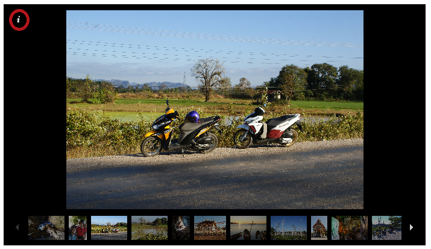
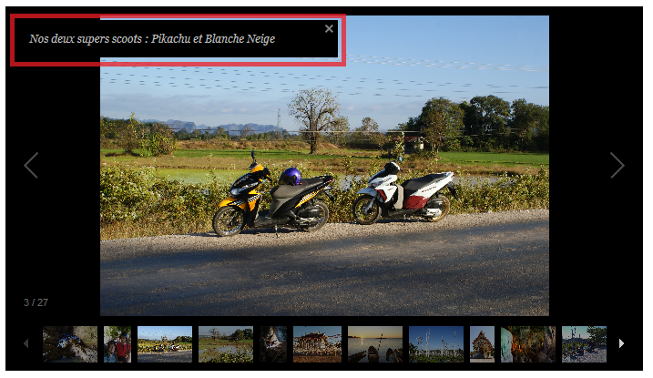

Title: Les légendes sont là !
Date: 2019-01-17 17:40
Category: Vie du blog
Slug: Legende
Status: published
SubTitle:
Cover:
Thumbnail:

Vous avez bien lu ! Les légendes des images arrivent également sur le blog ;)

On s'est dit que parfois, quand même, le lien entre les photos partagées et le texte n'était pas toujours très... évident. Donc voici nos petits commentaires pour rendre l'immersion encore plus forte :p !

Pour les plus perspicaces d'entre vous, vous aurez déjà percé à jour le mystère. Pour les autres, une brève explication avant que vous passiez à côté.

Voici comment se présente une image:

Avec un petit "i" d'information, pour les légendes (logique...).  
Vous cliquez dessus et tadaaam !!!

En vrai il n'y aura pas le cadre rouge, pour ceux qui se demandent.

Et maintenant, travaux pratiques !!!
Mets en commentaires les légendes des images suivantes, sans regarder la copie du voisin (non je rigole !!! ... vraiment... pas besoin de les mettre en commentaire).

    
    
<\div>

