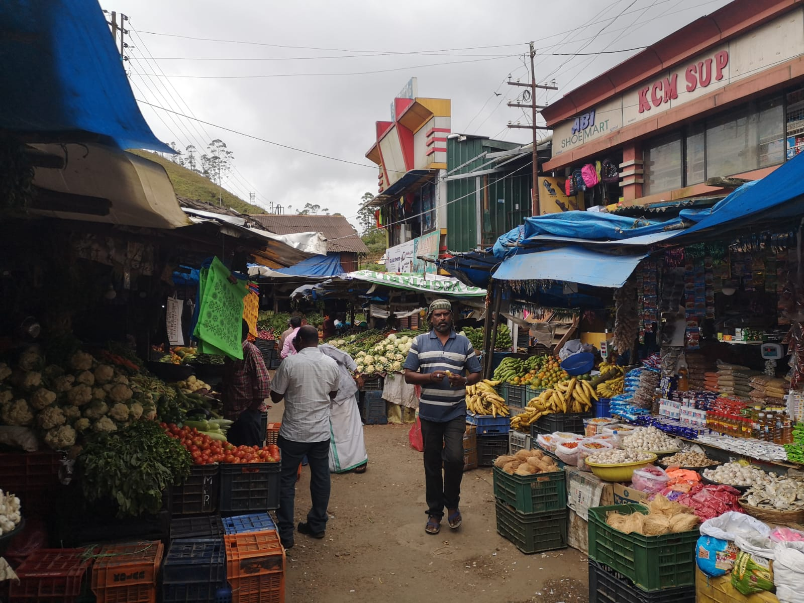

Title: Luang Prabang
Date: 2018-12-12 10:40
Category: Asie du Sud-Est
Slug: LuangPrabang
Status: published
SubTitle: La ville des temples
Cover: images/LuangPrabang/LuangPrabang_24.jpg
Thumbnail: images/LuangPrabang/LuangPrabang_18.jpg

#Luang Prabang

Nouvelle ville, nouvelle expérience ! Avec Sylvain on se décide à booker une nuit en dortoir (je le faisais bien dans ma jeunesse de baroudeuse fauchée, donc ça va pas nous tuer). Mais voilà, maintenant on est des vieux cons. Donc le dortoir de 14 lits, avec des gens qui rentrent à toute heure de la nuit, c'était sûrement too much. Résultat, le lendemain on se cherchait une guesthouse dans une petite rue à côté de la poste. Après en avoir vu une quinzaine, on se dégote une petite piaule sympa à 80 000 khip, et on déménage. Bref, on a bien vieilli... Mais je lâcherai pas l'affaire du dortoir !

L'après midi on se ballade tranquillement et on découvre cette ville qui est parfois qualifiée de meilleure ville d'Asie. En Asie on a un peu l'impression que chaque pays a SA ville "fantastique" mais blindax de touristes. On s'attend donc à un Ubud, Hoi An, Chang Mai... Et bien un peu... mais pas tant! Cette ville considérée comme la capitale culturelle du Laos est bourrée de charme ! Luang Prabang est située sur un bras de terre bordé d'un coté par le Mékong et de l'autre par la Nam Khan (sachant que Nam veut dire rivière en laotien). Donc une grande rue avec beaucoup de restos pour touristes, et différents temples que nous visiterons quelques jours plus tard. Pour le moment, on s'imprègne de l'ambiance générale, et on a de belles surprises. LPB reste très touristique, surtout le soir quand le marché nocturne envahit la rue principale avec ses dizaines d'étals similaires. Mais il y a une ambiance très paisible où il fait bon chiller, et c'est d'ailleurs notre activité principale.

On retrouve assez vite nos potos de l'équipe de la traversée de frontière. J'ai nommé Caro, Manon les copinettes qui se font un trip ensemble, Calum et Lindsay, les londoniens trentenaires qui ont tout laché et qui veulent percer sur instagram pour voyager toute la vie, Alexis le québequois qui se laisse porter, et Raph et Guillaume deux potos qui se font aussi un trip asiatique. A chaque étape depuis la frontière on a plaisir à se retrouver pour partager des bières et des aventures. Donc le lendemain on se décide à aller voir une cascade très réputée tous ensemble, mais avant que les bus de chinois n'arrivent donc a 7h30 sur le site.

# Les cascades de Kuang Si

Autant vous dire que lendemain on se retrouve pas bien frais, et on part en direction de la cascade de Kuang Si avec le tuktuk négocié la veille. On est seuls, et on se dit après un petit café qu'on a bien fait de se motiver si tôt. La visite commence par un passage dans un centre où ils recueillent des ours dénutris ou maltraités et leur refont une petite santé. Ce sont des ours noirs de taille assez modeste, mais ils sont tellement patapoufs. Le lobby de l'ours en peluche a bien fait son boulot, ils me font fondre malgré leurs jolies griffes qui peuvent t'arracher la tête en deux-trois coups.
Puis on reprend la marche, et on suit le cours d'eau qui est d'un bleu turquoise translucide quasi irréel. Si le paradis existe je pense qu'on doit pas en être loin. On passe par plusieurs petits lacs et cascades pour arriver à la principale. C'est sublime, il n'y a rien de plus à dire. 
Le tuktuk nous attend mais il nous reste du temps on se décide à monter pour prendre de la hauteur (perso, en haut je n'ai rien vu), puis à faire quelques kilomètres pour aller voir une cave. L'entrée de la cave est payante, ce qui n'était signalé nulle part, et payer à l'intérieur d'un site payant nous saoule. Donc non.

On finira la journée à faire la sieste et à jouer au Cambio dans notre bar de prédilection, l'Utopia. Le soir, direction pour la seconde fois le marché nocturne pour manger. Cette partie du marché nocturne est situé dans une rue piétonne minuscule et un peu glauque, j'a-dore ! On peut y manger pour 1,5€ un buffet à volonté de plats végétariens, et acheter à côté une profusion de brochettes de viandes et de poissons cuits au barbeuc. Bref parfait pour les végétariens, les carnivores, les grands et petits appétits. 

# La journée de la tristitude

Mais... cette deuxième fois au marché m'a été fatale et la nuit qui a suivi plutôt chaotique. Le lendemain, adieu le petit cours de yoga prévu avec les filles, et je ne peux pas vous raconter grand chose. Sylvain s'est balladé et est allé voir le coucher de soleil sur le Mékong avec Jean Pierre, son nouveau poto retraité. 

# The last day but not least

Pour ce dernier jour on reprend la découverte de la ville. Au programme, trois très beaux temples, un palais, des enlevages de chaussure à répétition et des couvrages de gambettes (ce qui n'est pas français, mais non aux jambes à l'air dans les temples !).

Le palais, nous n'avons pu en voir que les jardins, car pour pouvoir en voir l'intérieur, il fallait s'y pointer avant 11h... Mais on profite quand même bien du jardin ainsi que des écuries ou on voit toutes les voitures du roi. 
Puis direction le Wat Xieng Thong. Petit point d'histoire, merci Wikipédia : il a été fondé en 1560 par le roi Setthathirat du Lan Xang. Le Lang Xang voulant dire pays du million d'éléphants, il était associé à l'état khmer et correspondant grosso modo aux frontières actuelles du Laos. Ce temple est considéré comme l'un des plus élégants du pays. Nous nous dirigeons ensuite vers le Wat Siphoutthabat puis le Wat sirimoungkhoun. Je vous laisse regarder les photos pour en avoir une idée précise !
Pendant cette promenade, on croise différents groupes de moines, tous habillés en drapé orange. Nous croisons plusieurs fois au fil de la journée nos différents groupes de copains, ce qui donne un peu l'impression d'être chez soi. Caro nous apprendra que les moines suivent des règles strictes et nombreuses (sans surprise), qui se rajoute au fur et à mesure que le novice avance dans sa formation. Ils n'ont notamment pas le droit de courrir, même après le bus. Moi qui suis toujours à la bourre et donc en train de courrir, je décide donc de rayer "moine" de mes potentielles ré ré réorientations.

Demain on se sépare de la joyeuse bande :'(  ==> direction Nong Khiaw,
J'ai hâte !

PS : grand père, l'aéroport a été racheté par les chinois, qui ont tout rasé. Je pense que les termitières éternelles y sont passées aussi !

    
    
    
    
    
    
    
    
    
    
    
    
    
    
    
    
    
    
    
    
    
    
    
    
    
    
    
<\div>

