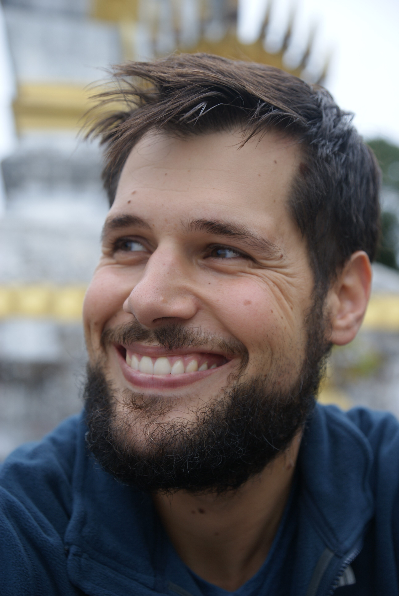
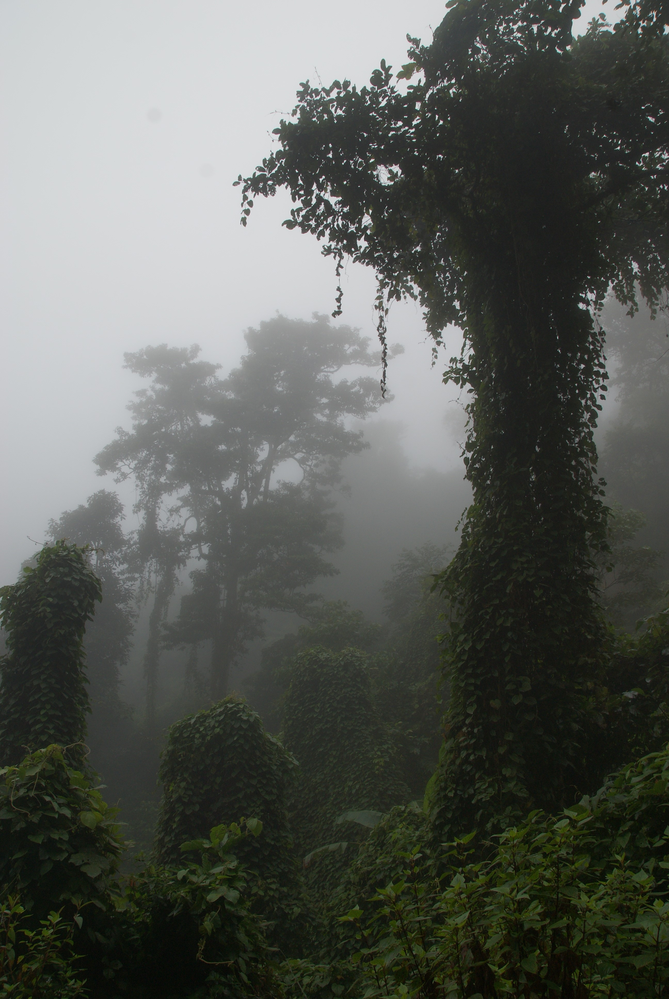
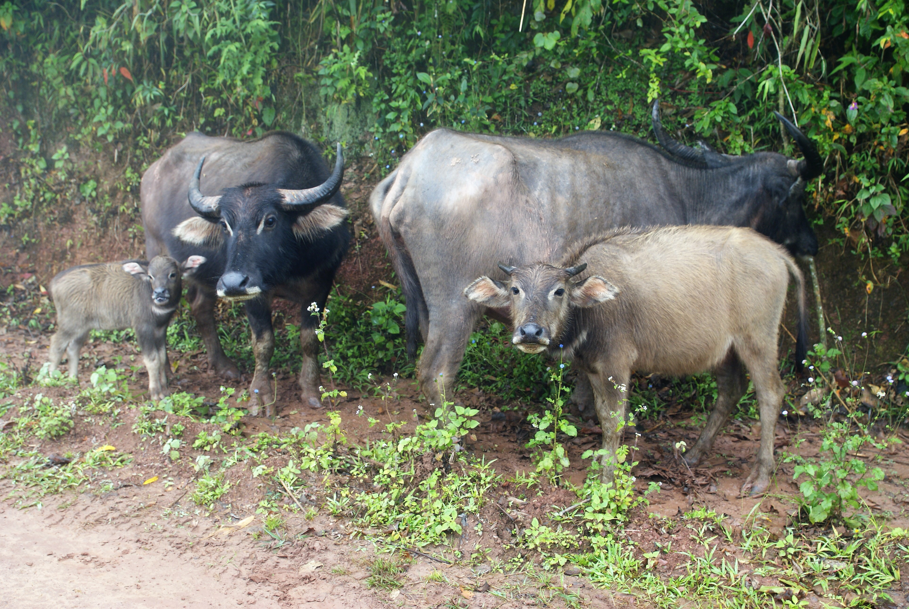
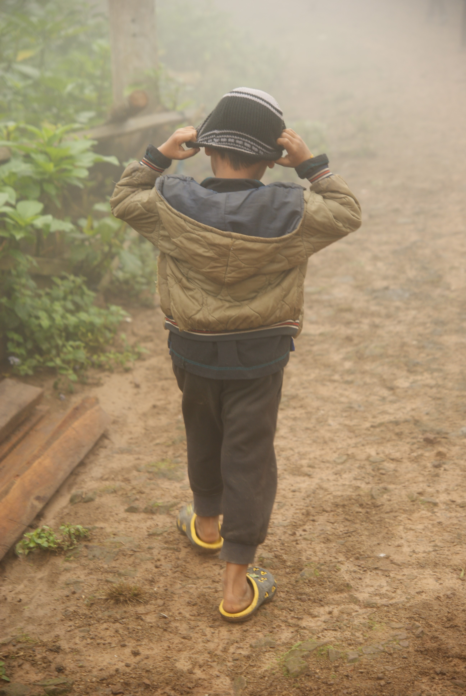
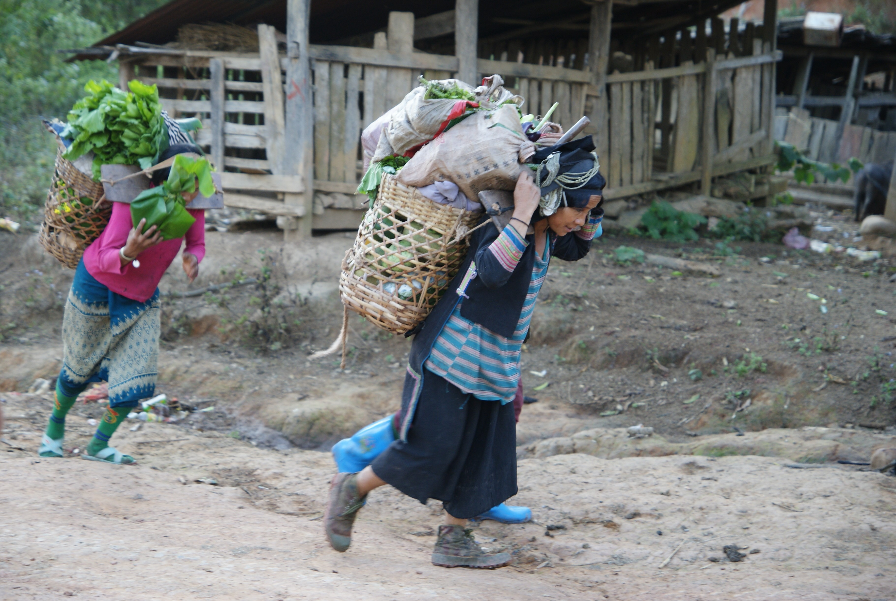

Title: Phongsaky et la redescente
Date: 2018-12-21 10:40
Category: Asie du Sud-Est
Slug: Phongsaly
Status: draft
SubTitle: Avec de la pluie, des sang-sues et le 5 à 7 laosien
Cover: images/Phongsaly/Phongsaly_13.jpg
Thumbnail: images/Phongsaly/Phongsaly_00.jpg

# Phongsaly, ça se mérite !
Comme on l'a déjà dit, entre Muang Khua et Phongsaly, il ya 208 km. Mais ici, ça ne sert pas tellement de parler en distance, puisqu'on mettra environ 9h pour parcourir la distance. Le plus frustrant c'est qu'on nous fait des fausses joies, d'abord on annonce 5h de trajet, puis 7h et finalement c'est bien 9h que ça nous aura pris. Et c'était long à la fin !  
M'enfin on arrive à bon port, comme toujours de toute façon, mais la nuit est déjà bien là, et on se rend alors compte que l'hotel qu'on a réservé n'est pas indiqué au bon endroit sur Booking, mais se trouve en fait à 20km d'ici. La bonne blague. On trouve donc une chambre dans une chambre d'hôte gràce à la famille de français qui nous accompagne. Je remarque que sur le coup, on a eu des réflexes très différents. Nous avons préféré nous arrêter et chercher un endroit avec internet sur nos smartphones, et eux ont arpenté les rues en essayant de trouver des solutions. ET ils ont été plus éfficaces que nous, il faut le reconnaître.  
Le point délicat dans cette région frontalière avec la Chine c'est que peu de gens parle en réalité anglais. Bien souvent les panneaux ou les menus sont écrits en laosien et chinois, donc aucun alphabet qu"on sait lire. Cela donne un côté bout du monde plaisant mais un peu galère. On sait pas trop ce qu'on commande à manger, ni vraiment où vont les bus, etc. Mais c'est ça aussi l'aventure !

Malheureusement pour nous, Phongsaly est assez pluvieux, et notre premier jour sur place se trouve être un dimanche. Donc l'office de tourisme qui propose des treks est fermé. C'était pas prévu dans notre planning bien huilé, et on décide de changer les plans, de rester un jour de plus pour pouvoir faire un trek tout de même (tout du moins à des prix raisonnables). On visite donc la ville et ses environs. C'est en réalité une petite bourgade de montagne mignonne et bien paisible, et on peut dire qu'on sent qu'on est (enfin) sortis des sentiers touristiques balisés. Le soir on tombe même sur une délégation officielle qui occupe le restaurant non loind de notre hôtel, et on nous invite à boire du lao lao, l'alcool de riz d'ici (en apéritif). On comprend aussi vite que l'anglais incertain du chef est en parti lié à un peu d'excès de ce fameux breuvage. Mais cela était tout de même très amical !  
Le deuxième jour on a la droit à la découverte d'une coutume locale qui consiste en un message radio de 2h30 avec les nouvelles du coin, de la musique, de la pub (tout de même) et sans doute quelques messages de propagande du gouvernement. Le seul hic c'est que la beuglante commence à 5h du mat' !!! Et ici à Phongsaly, ils rigolent pas, il y a des antennes un peu partout avec des haut-parlerus qui balancent le son un peu partout dans la ville. Immanquable, d'autant plus que notre hôtel est en face d'une de ces antennes. On était ravis ! On va ensuite voir l'office du tourisme, choisit un trek avec la petite famille toujours, et à mesure que la journée avance je sens que ça ne va pas de mon côté. Du coup, un peu en panique à l'idée d'être malade juste avant le trek, je décide de me reposer tandis que la smala (à savoir la famille, Maïlys et un couple d'allemands) décident d'aller visiter les plantations de thé avec des arbres de près de 400 ans. Ils ont le droit à la cérémonie et tout. Quand à moi après-midi cauchemard, je me retrouve avec 39,2 au thermomêtre, fracassé. J'ai été avisé de passer mon tour pour la balade, et même le soir je me sens nettement mieux (bien qu'un peu faible) et donc plus confiant pour les 2 jours suivants.

# Le trek dans un village Akha
On a choisi un trek assez facile de 2 jours pour aller visiter un village Akha, faire quelques activités, y dormir et revenir vers Buen Nuea, village carrefour d'où on peut récupérer facilement des bus. Le premier jour c'est quelques 5h de marche annoncées, faciles, avec un petit col dans la jungle à passer. Ca ne nous semble pas très compliqué. Oui mais c'est sans compter que la veille, il a beaucoup plu. Et que c'est un sentier emprunté par les buffles. Et donc... des sang-sues à gogo.  C'est véritablement infesté de ces bestioles et personnes n'y réchappe. Il faut constamment regarder ce qui monde sur la chaussure et même avec ça, on se retrouve assez durement touchéS. Là pour le coup c'est l'aventure ! On arrive donc au village Akha ravis de laisser ces bestioles dans la jungles et de pouvoir se reposer un peu en visitant le village. Le soir on a le droit au traditionnel lao lao ("chipata", qui veut dire "santé" en langage Akha), un sacré bon repas et un message Akha (qui consiste principalement en une malaxation assez vigoureuse de tout le corps, mais qui laisse un sentiment plutôt agréable). Tout au long du trek, les locaux sont fascinés par les deux enfants de 7 et 9 ans qui nous accompagnent puisqu'ils n'ont jamais vu d'enfant occidentaux, et il trouveront aussi très vite des compagnons de jeux en la présence des enfants du village. Il y a des langages universels !  
On dort dans la maison du chef du village, dans ce qu'on pourrait appeler le salon, une sorte de pièce commune qui dessere les autres chambres partagées par la famille. Ici pas de chambre individuelle, c'est une vie en communauté, et le même modèle de maison pour tout le village. Ici ce sont les femmes qui se lèvent en premières pour préparer la nourriture, ensuite les hommes et les enfants, et hop la journée démarre. En tant qu'invités on a le droit de flemmarder un peu au lit, et ensuite on est partis pour une petite activité cueillette au jardin pour la cuisine du midi. Il nous semblait à tous qu'on devait cuisiner tous ensembles ensuite mais le guide se charge de la popotte tout seul et nous laisse papilloner dans le village.  
Et nous voilà repartis après le repas, et déjà on sent que le temps est incertain. Il y a eu quelques gouttes le matin, on espère tous que ça va s'arrêter là. Je ne fais pas durer le suspense plus longtemps, on a pris la saucée pour le reste de la marche jusqu'au village. On est littéralement trempés, ça caille un peu, et on fini par débarquer dans un hôtel assez douteux. Parfois les temps sont durs. Une fin de voyage éprouvante donc, juste avant notre grand départ pour le sud et ces quelques 24h de bus...

# La redescente
On souhaite se rendre à Thakhek pour aller faire une boucle qui apparammenet vaut le coup d'oeil. Mais on est tout au nord... On se lance donc dans un périple de 24h pour se rendre à Vientiane, et ensuite il nous faudra rejoindre Thakhek. Et comme on veut pas trop traîner, on décide de partir avec le "sitting bus" le bus pour les locaux. Et effectivement ça nous a bien pris 24h pour tout descendre, c'est long, c'est fatiguant (et la pauvre mamie laosienne qui a vomi tout du long) mais on est arrivés à bon port sans encombres. On s'octroie donc une journée et une nuît de repos dans la capitale, on recharge les batteries, lessive et tout le reste. On se paye le luxe d'une pizza, on avait clairement une envie de bouffe occidentale, et nous voilà fin prêt pour le départ pour Thakhek.  
La route vers Thakhek n'a rien d'extraordinaire, à part que les 5h annoncées se sont transformées en 7h30, mais on a fait la rencotre d'un bourlingueur français, André (je crois) qui a bien roulé sa bosse et nous a longuement parlé de sa façon de voyager.  
Arrivés à Thakhek on tout juste le temps de se rencardés sur la boucle et nous voilà parti pour 4 jours de roadtrip prometteur en scooter.

    
    
    
    
    
    
    
    
    
    
    
    
    
    
    
    
    
<\div>

