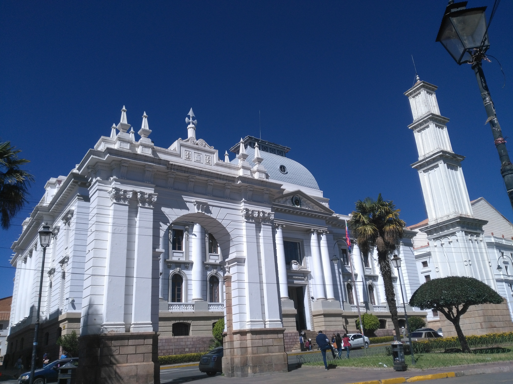
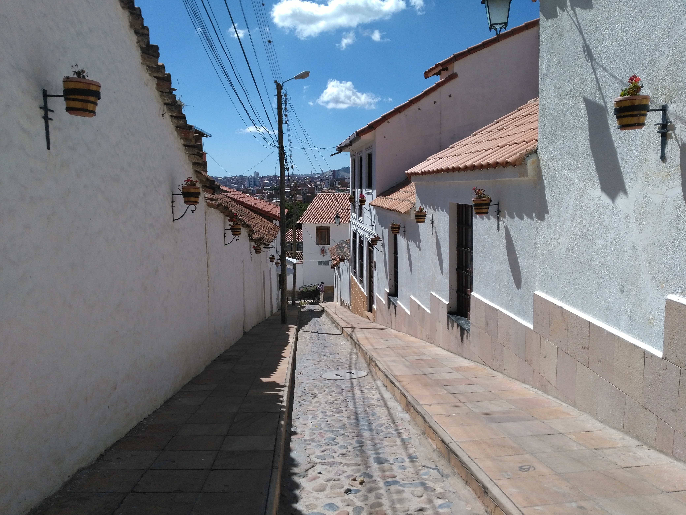
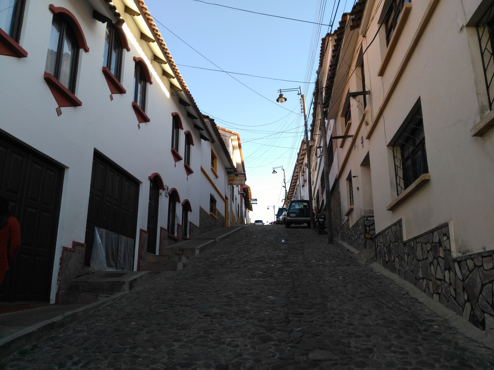

Title: Potosi et Sucre
Date: 2019-05-14 12:54
Category: Amerique du sud
Slug: PotosiSucre
Status: published
SubTitle: Le coeur de la nation bolivienne
Cover: images/PotosiSucre/PotosiSucre_08.jpg
Thumbnail: images/PotosiSucre/PotosiSucre_00.jpg

# Potosi
Après notre petit tour dans au salar d'Uyuni et du parc national avoisinant, nous voici de passage à Potosi. On y restera finalement qu'à peine une demi-journée, mais Potosi est une ville importante pour le pays. En effet, c'est à côté de Potosi que se trouve la plus grande mine d'argent du monde qui a alimenté en ce precieux métal le nouveau comme l'ancien continent pendant des siècles. Ce fût donc un centre économique extrêmement important pendant longtemps, et si aujourd'hui la mine n'est plus exploitée par l'état bolivien, il reste encore des coopératives de mineurs qui y travaillent et arrivent encore à extraire un peu de minerai. N'ayant pas eu le temps de beaucoup nous renseigner sur la ville, je ne peux pas vraiment en dire plus. Il se dit qu'avec tout l'argent sorti de la montagne on aurait pu construire un pont entre l'Amérique Latine et l'Europe. D'autres disent que c'est avec les ossements des mineurs decédés dans cette mine qu'on aurait pu constuire ce pont. Je ne me souviens plus du chiffre avancé, mais il est éffarant. Déjà beaucoup d'indigènes, réduits en esclavage par les colons espagnoles, ont péri en travaillant dans des conditions désastreuses, vous vous en doutez. Ensuite, aujourd'hui encore, le métier de mineurs est extrêmement dangereux et régulièrement des mineurs perdent la vie au fond de la montagne. Quand bien même, du fait de la pénibilité du travail et des produits toxiques utilisés pour l'extraction des minérais, l'espérance de vie d'un mineur est d'une quarantaine d'années (quand on lui demande de commencer à travailler dans la mine vers 15ans, même si c'est officiellement interdit, aucun contrôle n'est effectué). On sent d'ailleurs que l'état bolivien a complètement délaissé le problème des mineurs, aucune aide, aucun cadre n'est donné à la profession pour réglementer ou améliorer les conditions de travail.  
On peut d'ailleurs aller visiter les mines, au milieu des travailleurs. Même si on a eu des retours comme quoi c'était intéressant, nous n'avons pas souhaité faire cette expédition. Déjà parce que faire du tourisme à côté de gens qui galèrent littéralement on a déjà donné à Ijen et que ça nous a laissé un goût amer (donc pas envie de réitérer), et ensuite puisque la mine, petite et étouffante, ça fait peur. Mais surtout parce que ce n'est pas le genre de tourisme que l'on souhaite soutenir ou encourager.

Reste donc que Potosi s'est construite sur les richesses incroyables de son sol pendant des années, et donc est une ville importante, animée et je dois le reconnaître, dans son centre, plutôt agréable. Le peu que l'on a vu nous a plutôt plu, pour notre première vraie ville bolivienne.

Notre vraie envie, c'est quand même de vite nous diriger vers la prometteuse Sucre.

# Sucre
Ah Sucre (prononcer Sucré) ! Il y a beaucoup à dire.

Déjà il faut expliquer que Sucre est la capitale constitutionnelle de la Bolivie. Ah. Qu'est-ce que ça veut dire ? Dans la constitution de la nation bolivienne, il est écrit noir sur blanc que Sucre est la capitale de la nation. Quid de La Paz ? En réalité, lors d'une guerre civile (et pour des raisons que j'ignore), le gouvernement et les institutions se sont retrouvés à La Paz. Donc dans les faits, La Paz se trouve être donc la capitale puisque siège du gouvernement. Cela remonte à des années (XXVIIIème siècle je crois), donc maintenant il n'est pas tellement question de revenir en arrière, même si les habitants de Sucre semblent l'avoir encore amer. Petit spoiler : La Paz est de toute façon maintenant tellement plus grande et forte économiquement comparativement à Sucre que cela ne voudrait plus dire grand chose.  
Bref nous voici donc dans la "capitale" du pays. Cela veut au moins dire que la ville a un bout d'histoire. C'est ici que l'indépendance a été déclarée et le pays créé. Et c'est déjà pas mal !

La ville s'avère être très agréable, et encore heureux pour nous puisqu'on a dû y traîner un peu plus que prévu. Beaucoup de petits coins sympas, de jolies batisses, mais surtout un classement comme patrimoine mondial à l'UNESCO, c'est pas peu dire. La ville est faite de quartiers de maisons coloniales assez imposantes, avec de grands patios intérieurs, maintenant reconverties en musées ou autres bâtiments publiques, et de plus petites maisons plus modestes (mais tout autant classées). La conservation de ce patrimoine n'est pas aisé, malgré l'argent donné par l'UNESCO, surtout concernant les quartiers résidentiels possédants les petites maisons colonniales. En effet il est donc interdit dans ces quartiers de détruire pour reconstruire. Il n'est possible que de réparer à l'identique. Déjà ces bâtisses sont très vieilles, souvent cela représente des coûts d'entretient importants. De plus ces vieilles maisons répondent maintenant difficilement au standard de comfort attendu par les gens. Du coup beaucoup préfèrent abandonner ces habitations pour les laisser s'effondrer et pouvoir ensuite construire à neuf. Ce qui à terme met en danger l'intégrité du patrimoine et risque de faire perdre à la ville la subvention de l'UNESCO et donc une manne financière importante (et un intérêt touristique par la même occasion).  
Toujours est-il donc que Sucre est un ville agréable à visiter et surtout avec beaucoup de coin "pour touriste" (j'entends par là des café/restau un peu branchés ou un peu hippie/bohême) qui parfois sont très agréables.

Il y a aussi un marché central important et très agréable, où touristes et locaux se mêlent (l'on peu y manger pour pas cher), autour duquel s'est construit tout un quartier commerçant. Il y a aussi le fameux parc Simon Bolivar qui anciennement était réservé aux personnes parlant français (signe d'aristocratie visiblement) dans lequel se trouve une tour Eiffel mignature (vraiment construite par Eiffel), peinte en orange maintenant.  
Une visite guidée de la ville a été pour nous l'occasion de quelques découvertes. Déjà politique : le président, Evo Morales, est en train de se transformer en dictateur (pour des raisons que je ne détaillerai pas ici, ça mérite un article entier. Du coup des articles beaucoup mieux faits et documentés sont disponibles ;) ). Pas top. Ensuite la chicha, cette boisson faite à base de fermentation de maïs, qui se boit "comme une bière" dans les bars à chichas, prisés des locaux. La fermentation est faite grâce à... la salive des gens. Ce sont en fait les restes de maïs machés qui sont recrachés dans un sceau, qu'on laisse ensuite fermenter et dont on tire le précieux brevage. Du coup, même si le procédé de fermentation "élimine" les bactéries et autres saletés, ça n'apparaît pas comme très ragoutant aux touristes qui délaissent ce genre de lieu. On a aussi pu goûter le chimimoya, délicieux fruit de la région. Mais pour nous, le clou du spectacle a été la découverte des cultures indigènes (Incas, Aymara, Quechua) et notamment l'activité de tissage qui a connu une renaissance depuis une vingtaine d'années grâce à des initiatives de tourisme et commerces équitables. Les tissus brodés sont empreints d'histoires des familles et villages ou des mythes de ces cultures andines. Le plus étonnant pour nous étant que certains arrivent à tisser des motifs très complexes d'animaux mythiques enchevêtrés sans aucune forme de motifs prédéfinis ou symétries, le tout étant du fait de l'inspiration du tisseur (souvent une femme au passage). Impressionnant.

Voilà, Sucre aura été pour nous une petite pause très agréable, mais déjà nous devons passer à la suite, La Paz, la vraie fausse capitale.

    
    
    
    
    
    
    
    
    
    
    
    
    
    
    
<\div>

