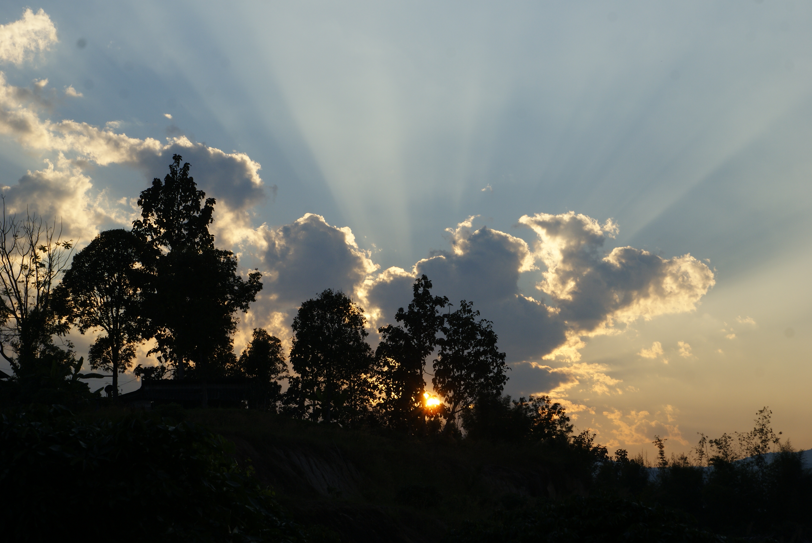

Title: Le volontariat chez Pui
Date: 2019-02-05 20:40
Category: Asie du Sud-Est
Slug: Pui
Status: published
SubTitle: Mimi cracra l'eau elle aime ça
Cover: images/Pui/Pui_10.jpg
Thumbnail: images/Pui/Pui_08.jpg

# L'arrivée chez Pui

Après un petit coup de song thaew, le minibus local, Pui vient nous chercher pour nous emmener chez elle. Nous arrivons dans un grand jardin qu'on pourrait même qualifier de grand parc. Il y a des sortes de bungalows/chalets répartis sur tout le terrain mais assez peu pour donner une vraie sensation d'indépendance. La maison principale est constituée de l'espace de vie de Pui et d'un salon/salle manger/cuisine ouvert sur l'extérieur. Tout au fond du terrain se trouve son atelier puisqu'elle est artiste peintre-créatrice d'objet-sculpture. Et à l'occasion elle veut construire ses maisons en terre voire même un coffeshop, ce qui nous amène chez elle aujourd'hui. 
On a tout de suite une énorme sensation d'apaisement et de liberté après la pagaille de Chiang Mai. La lumière de fin de journée, cet immense jardin, ces grands arbres et notre bungalow complétement isolé : on respire. Et on est plein de pêche pour bosser. Après trois mois et demi de voyage d'itinérance et de tourisme, se poser et construire quelque chose avec ses mains nous semble être le plan parfait. Sur place nous rencontrons un couple allemand, une américaine qui repartent le lendemain et un canadien, "Dash", qui reste encore une semaine. Ils ont quasi tous été malades et l'allemande a même été à l'hôpital donc ils n'ont pas trop bossé la semaine d'avant.

Quand on exprime notre enthousiasme à Pui pour le projet elle nous répond inlassablement "it takes time" (ça prend du temps). Et c'est une phrase qui va prendre tout son sens pendant ces deux semaines. 

# Le "boulot"

Le lendemain on commencera finalement à travailler. Nous allons bosser 6 jours par semaine à partir d'environ 9h jusque 12h30. Le jour de pause sera le lundi, pour ne pas être embétés par les foules du week end. Le matin on se lève, on va petit déj jusque là rien d'extraordinaire sauf quand on voit la qualité des repas. Pui est une cuisinière extra et elle nous fait des repas de folie petit déj inclu. Elle est aussi très très trèèès portée sur le piment et sa mission ultime est d'augmenter notre tolérance aux épices. Raté pour moi j'aime vraiment pas le piment !

Après le petit déj direction la maison en construction. Il faut d'abord préparer la matière première : la boue. Donc nous béchons pour récupérer la terre et préparer de grandes bassines. Cette terre est mélangée à plus ou moins de paille de riz et d'eau selon la consistance souhaitée. Et après pas de chichis il faut mettre les pieds dans le plat et piétinner dedans jusqu'à ce que la consistance soit homogène. Une fois qu'elle est obtenue on fabrique soit des briques qu'il faudra laisser sécher soit de la "glue" à mettre entre les briques pour monter les couches.

Avec Sylvain notre première mission aura été de construire un banc d'angle avec des arrondis un peu type Gaudi. On a donc d'abord monté une première rangée pour se familiariser avec le matériau puis une seconde. Et enfin les finitions à la "glue" et à la mosaïque de carrelage vert. 

Seconde mission on a tous fait un lit 2 places mode thaïlandais c'est à dire de 2 mètres de large. Une rangée de brique remplir le milieu de déchets (tà ´le faïence et autres) qu'on casse à la pioche. Puis on recouvre le tout d'une couche de brique on lisse le tout avec la glue. Et on a fini par faire une rangée d'étagère sur le pourtour avec des bambous et de la boue renforcée avec de la "vraie" paille. 

Enfin on a fini un mur de la maison qui s'était effondré. 

On est pas peu fiers de notre boulot et c'est quand même top de pouvoir bosser avec ses mains ses pieds et surtout de voir directement le résultat. En plus de tout ça on a appris des techniques dans un domaine qu'on ne connaissait pas du tout et ça nous a donné des idées et des perspectives pour la suite. Niveau boulot donc 100 % de positif !

Par contre l'après midi on est encore sous pression, donc c'est un programme bien rempli : sieste glace petites ballades dans la campagne environnante. Et parfois quand on bosse pas Pui nous enmène tous dans le pick up pour aller se baigner. Gros gros programme je vous dis ! 

# L'environnement

Bon j'ai déja bien jacassé sur le parc donc je ne vais pas en remettre une couche (c'était génial). Tous les jours on va se faire une petite ballade avec Sylvain et franchement la campagne thaïlandaise est belle ! En plus dans ce coin un peu reculé les gens ne s'attendent pas à croiser des étrangers et sont ravis de te voir. On se fait des coucous, on se salue et mêmes certains nous font des grands monologues en thaï pour nous parler d'un sujet qui leur tient sûrement à coeur. 

Mais surtout, ce qui est dingue c'est qu'on a du temps, et du temps de qualité. Parce que le reste du voyage chaque moment de pause il faut prévoir son prochain mouvement, donner des nouvelles, faire les comptes, écrire un article, trier les photos, se renseigner, bref le programme en voyage est chargé aussi. Mais là passé les premiers jours où on remet à plat le blog, et on finit les comptes, on a rien à prévoir juste du temps brut pour nous. C'est juste génial.

Donc on cogite à des trucs sur lesquels on a jamais le temps de faire le point, on fait du sport, on prend des résolutions, il dessine, j'écris, on prend des nouvelles des proches, on res-pire. Et aussi comme l'endroit est propice on se recentre et on médite. Pas avec des "OM" en tailleur, non on essaie juste parfois de focaliser sur le moment présent et d'en profiter.

Et pour ne rien gâcher on a fait quelques expéditions notamment à la sticky waterfall qu'on a pu escalader à contre courant et aller chiller dans des bassins bouillants en plein air avec des Thaï.

# L'apport humain

Encore là c'est un sans faute. Pui nous apprend par petites brides "la Thaïlande" : la langue, la nourriture et leur mode de vie. Elle nous parle de sa vie, de celle de ses amis et de ses parents qui habitent sur la même propriété. Comme elle est ultra habituée à recevoir des étrangers évidemment elle parle couramment anglais. Et c'est tout pile ce qui nous avait manqué. 

Mais on apprend aussi beaucoup des autres voyageurs. Comme dit Sylvain les locaux nous apprennent leur culture et les voyageurs nous apprennent à voyager. Mais quel poète !! On aura fait la majeure partie de notre expérience avec un couple de belges de Liège Astrid et Denis qui commencent tout juste leur périple. Denis est jongleur au feu rouge Astrid est en recherche d'inspiration après avoir quitté son boulot. C'est sa première expérience hors d'Europe, contrairement à lui qui a l'habitude de voyager en stop. Nous avons également rencontré Dash le canadien qui est en voyage illimité pour le moment et fait beaucoup de stages de yoga/méditation. Molly une américaine du Minessota en échange universitaire. Enfin Jérémy un toulousain qui est parti de notre belle ville en stop et camping sauvage il y a deux ans et demi et qui va commencer à enseigner l'anglais au Vietnam.

Ces gens nous ont permis de comprendre et d'apprendre beaucoup de choses sur leurs domaines de compétences ou leurs centres d'intérêt. Dash et Astrid nous ont parlé de méditation, Denis et Jérémy de voyage en stop à la roots. De belles sources d'inspiration qui nous amènent comme chaque rencontre à repenser notre façon de faire. Encore un énorme point positif !

Bref très chouette expérience à refaire !

Demain Pai la ville des hippies wait and see

Maïlys

    
    
    
    
    
    
    
    
    
    
    
    
    
    
    
    
    
    
    
    
<\div>

