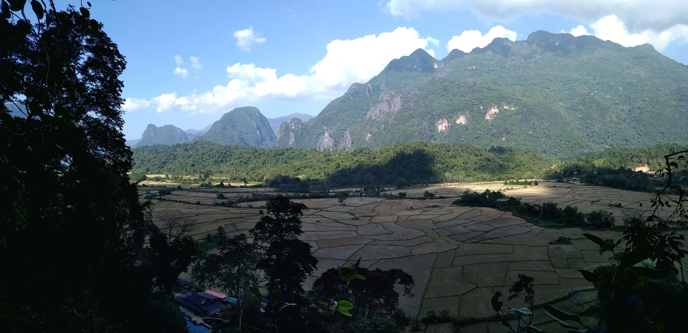

Title: Vientiane et Veng Vieng
Date: 2018-12-04 10:40
Category: Asie du Sud-Est
Slug: Vientiane_VengVieng
Status: published
SubTitle: La capitale tranquille et la ville des excès
Cover: images/Vientiane_VengVieng/VengVieng_03.jpg
Thumbnail: images/Vientiane_VengVieng/Vientiane_02.jpg

# Vientiane
Vientiane, capitale du Laos, apparraît très vite comme une ville tranquille,comme c'était annoncé. Et autant dire qu'avec 24h de bus dans les pattes, on est pas mécontent de ça ! On décide de rester quelques jours, sachant pertinement que le premier comptera un peu pour du beurre puisqu'il nous faut du repos. On le passe donc à flemmarder et reprendre des forces avec Manon et Caro, 2 filles rencontrées dans le bus, et quand elles decident de partir, on se motive pour un petit tour en ville. C'est effectivement très calme, et à part quelques temples qu'on croise, il n'y pas grand chose à voir non plus. Mais on apprécie l'ambiance posée (d'autant plus qu'on se loge dans un endroit qui correspond tout à fait à ça). C'est la ville du "chill" quoi !  
Le soir, au hasard d'une marche, on tombe sur une procéssion dans un des grands temples de la ville. L'heure est à la fête. Plein de familles viennent avec leurs sculptures de fleurs oranges, font le tour du temple avant de déposer le tout à l'interieur. Tout ça accompagné d'une musique entrainante et des feux d'artifices autour (avec une notion de la sécurité plutôt laosienne...). C'est un moment très chouette qui s'offre à nous au milieu de toutes ces processions. Les bouddhistes savent définitivement faire la fête (mais aucune idée de ce qu'ils célébraient).

Le lendemain on se motive pour aller visiter un peu plus en détail, on fait quelques temples et leur fameux arc de triomphe (Paris peut dormir tranquille, je vous rassure). Même si ce qu'on voit est très chouette, on tourne vite en rond, la ville n'a effectivement que peu à offrir en monument. Du coup on préfère s'attarder pour sentir un peu plus les ambiances, puis on décide de se rentrer pour trainasser et préparer la suite.

On se décide, comme beaucoup de touristes, pour Veng Vieng. La plupart de nos copains de galère de bus sont partis là-bas et les environs ont l'air chouette. Arrivera-t-on à se mettre au vert ?

# Veng Vieng
On avait eu vent du délire de Veng Vieng: la fête et les excès des touristes. Autant dire que les locaux n'apprécie pas forcément cette débauche, mais comme ça fait de l'argent, l'offre est là. Du coup, on est pas sûr d'adhérer aux délires, mais la joyeuse bande rencontrée dans le bus pour le Laos s'y rend (et ça semble être un peu un passage obligé de tout bon touriste). Donc on se dit qu'on profitera surtout d'un moment entre potes. Nous voilà parti pour 4h de bus chaotique sur une route bien cabossée. On en ressort donc un peu fatigués tout de même.

On se trouve donc une chambre d'hôte, un peu à l'écart de la ville (que l'on sait bruyante). On découvre un peu les environs et nous rejoignons donc certains de nos gais lurons pour un petit repas.  
Le lendemain c'est "tubing", comprendre une descente de la rivière sur des chambres à air, avec des arrêts dans les bars tout du long. Il semble que les autorités ont un peu mis le holà sur cette activité où les sur-excès étaient légion, suite à une année noire (on parle de 12 morts il me semble). Donc l'ambiance est à la fête mais ça reste bon enfant. Bières et autres alcools sont au menu accompagnés de la musique qui va bien. Et on ne se refait pas, nous restons trop longtemps dans chaque bar de sorte que nous n'arrivons pas à finir la descente avant la nuit, et un tuk-tuk nous récupèrere à un embarcadère. On finit la soirée tous ensemble, ce délire "bande de potes" nous fait du bien.

Pour la suite cependant, on veut quand même visiter les environs. Depuis notre hôtel on voit déjà les formations karstiques qui offrent déjà un paysage bien plaisant. On loue donc un scooter et nous voici parti pour un petit tour que Philippe, un soixantenaire rencontré ici, nous a conseillé. Et pour faire descendre la note, on s'essaye même à la fameuse boite manuelle, ce qui change un peu la donne. La route bitumée devient très vite un chemin caillouteux rempli de nids de poule. C'est un véritable exercice d'agilité plus que de conduite, mais on s'en sort. On s'arrête au "Blue Lagoon 3" (pour la petite histoire, il n'y avait qu'un seul lagon naturel, et devant son succès les lagons se sont multipliés dans le coin. On en compte maintenant 6 !), qu'on nous a dit le mieux, et il s'avère qu'on trouve une sorte de base nautique avec quelques points de sauts. Bon très vite on décide d'aller voir la petite cave (vraiment très petite), et avec les notions de sécurité laosiennes, on s'y est pas tenté, et un point de vue. Il nous faut monter dans la jungle sur un chemin pas vraiment entretenu, où les glissades vous guettent. Mais ça vaut le coup, on a une vue sur les champs de riz jaunis de la moisson avec en fond ces fameuses montagnes. On ne s'en lasse pas.  
On continue ensuite notre tour pour traverser des villages et se retrouver au coucher du soleil sur une route magnifique, et la lumière incroyable sur les rochers. Un beau moment. On retrouve ensuite nos amis, encore, pour la boustifaille du soir.  
Le lendemain matin, on prend des vélo pour aller voir le "blue lagoon 1", le plus touristique mais où on peut visiter une immense grotte qui nous a été conseillée. Et c'est effectivement incroyable, la grotte est gigantesque, et surtout sans chemin vraiment tracé. On est un peu livré à nous même, ce qui nous aura valu quelques erreurs d'orientation. Et une petite panique de Maïlys. Mais plus de peur que de mal, il est globalement impossible de se perdre définitivement là-dedans.  
Ensuite c'est le départ pour Luang Prabang, capitale culturelle du pays. On va voir ça !

    
    
    
    
    
    
    
    
    
    
    
<\div>

